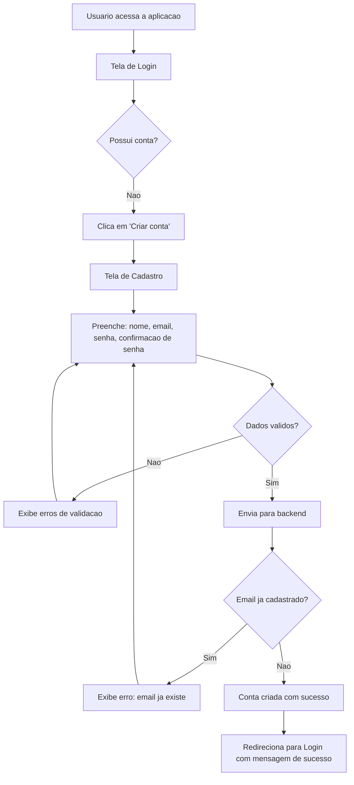
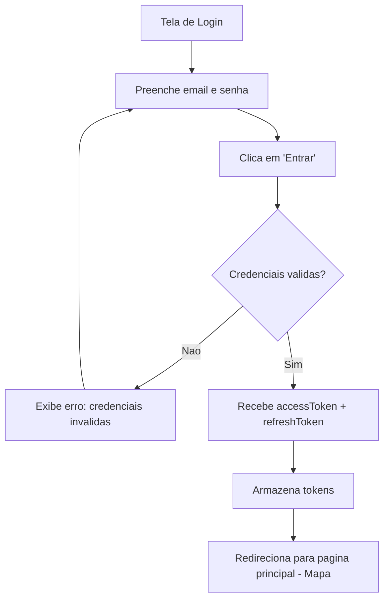
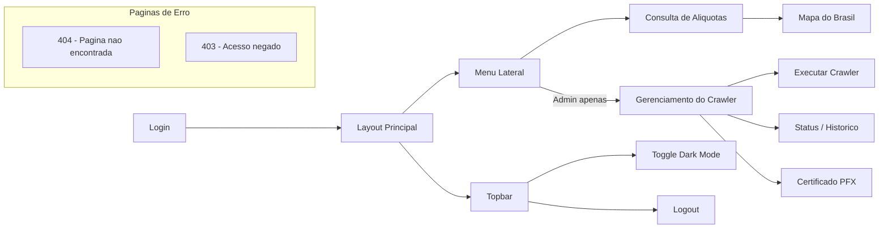
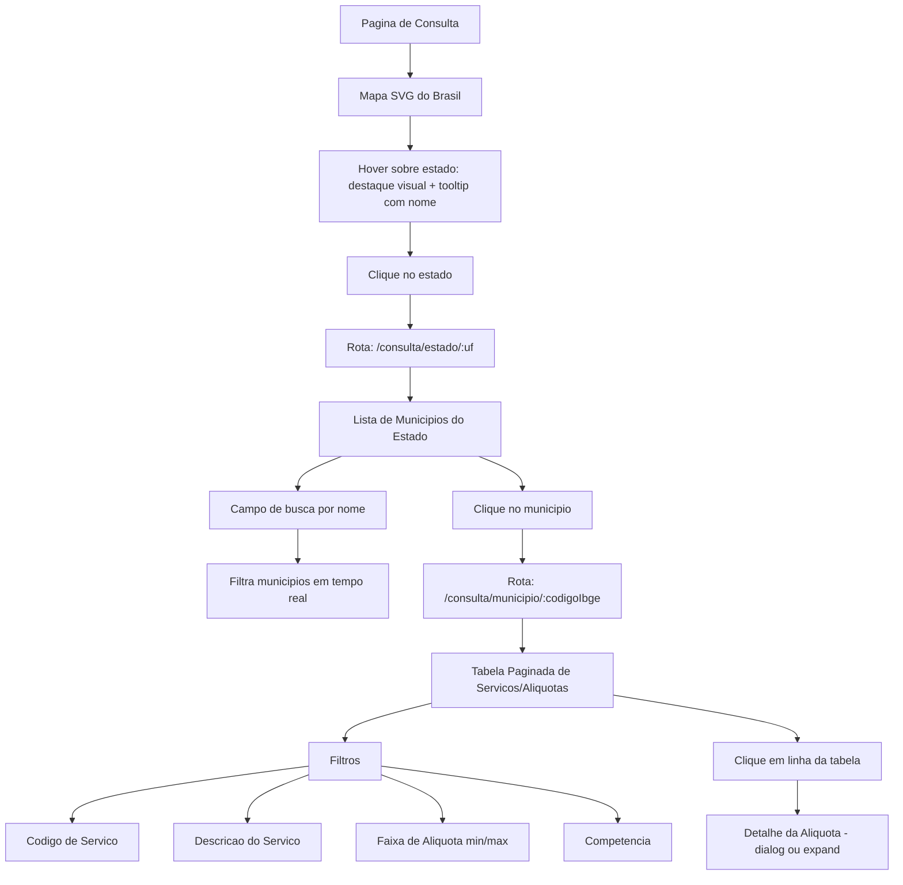
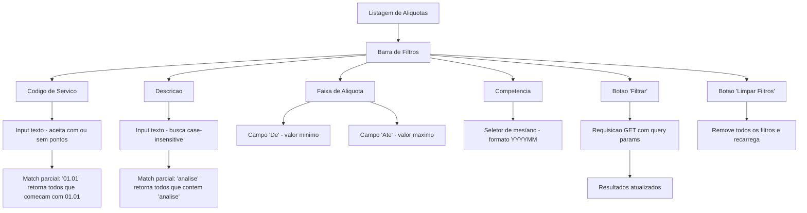

# Documentacao de Produto - Mapa Tributario

## 1. Visao do Produto

O **Mapa Tributario** e uma aplicacao web full stack que consolida e disponibiliza aliquotas municipais de ISS (Imposto Sobre Servicos) de todo o Brasil em uma interface navegavel e intuitiva. A solucao coleta dados da API NFS-e do ADN (Ambiente de Dados Nacional), materializa-os localmente e oferece uma experiencia de consulta visual por mapa, estado, municipio e codigo de servico.

### Proposta de valor

> Transformar dados tributarios fragmentados e de dificil acesso em uma ferramenta de consulta rapida, visual e confiavel para profissionais que lidam com aliquotas municipais de ISS.

### Visao de longo prazo

Ser a referencia para consulta consolidada de parametrizacao tributaria municipal no Brasil, evoluindo para cobrir todos os 5.570 municipios, com historico de competencias, alertas de mudanca de aliquota e integracao com sistemas contabeis.

---

## 2. Problema que Resolve

### Situacao atual (dor)

O Brasil possui mais de 5.500 municipios, cada um com autonomia para definir aliquotas de ISS sobre centenas de codigos de servico (LC 116/2003). A API NFS-e do ADN disponibiliza essas informacoes, mas de forma **fragmentada**: cada consulta exige a combinacao de municipio + codigo de servico + competencia. Nao existe hoje uma visao consolidada, navegavel e atualizada dessas aliquotas.

### Consequencias da dor

| Impacto | Descricao |
|---------|-----------|
| **Tempo perdido** | Consultores tributarios gastam horas pesquisando aliquotas manualmente para cada municipio |
| **Risco de erro** | Sem uma fonte consolidada, erros na aplicacao de aliquotas geram autuacoes e prejuizos financeiros |
| **Falta de visibilidade** | Gestores nao conseguem comparar aliquotas entre municipios de forma agil |
| **Barreira tecnica** | A API NFS-e requer certificado digital PFX e conhecimento tecnico para uso direto |
| **Fragmentacao** | Nao ha uma unica fonte que consolide todos os municipios e servicos em um lugar |

### Como o Mapa Tributario resolve

- **Crawler automatizado** coleta e consolida dados da API NFS-e periodicamente
- **Materializacao local** garante leitura rapida e independencia da disponibilidade da API externa
- **Interface visual** com mapa interativo do Brasil permite navegacao intuitiva
- **Filtros avancados** por codigo de servico, descricao, faixa de aliquota e competencia
- **Consulta publica** via web, sem necessidade de cadastro ou certificado digital para consultar dados
- **Cadastro opcional** permite coletar metricas de uso, identificar usuarios reais e proteger a aplicacao contra chamadas automatizadas por bots

---

## 3. Motivacao para Autenticacao

Embora o Mapa Tributario seja uma aplicacao **gratuita** e com **endpoints de consulta publicos** (nao exigem login para consultar dados), a aplicacao mantém o fluxo de cadastro e login por razoes estrategicas:

| Motivacao | Descricao |
|-----------|-----------|
| **Metricas de uso reais** | Identificar usuarios reais permite medir adocao, frequencia de uso, municipios mais consultados e padroes de navegacao. Dados anonimos de bots poluiriam essas metricas. |
| **Protecao contra bots** | A barreira de autenticacao desestimula scraping automatizado e chamadas massivas por robos. Mesmo que os endpoints de consulta sejam publicos, o frontend direciona o usuario pelo fluxo de login, criando uma camada de protecao humana. |
| **Base de usuarios identificados** | Ter uma base de usuarios cadastrados viabiliza evolucoes futuras como: alertas de mudanca de aliquota, favoritos, historico de consultas e comunicacao direta. |
| **Separacao de perfis** | Distinguir entre usuarios comuns (consulta) e administradores (operacao do crawler) garante que operacoes criticas fiquem restritas. |

### Dois perfis de usuario

| Perfil | Permissoes | Como e definido |
|--------|-----------|----------------|
| **Usuario (User)** | Consultar estados, municipios, aliquotas; navegar pelo mapa; usar filtros; acessar toda a parte de consulta | Qualquer usuario cadastrado recebe este perfil por padrao |
| **Administrador (Admin)** | Tudo do perfil User + executar crawler manualmente, gerenciar certificado PFX, consultar status e historico de execucoes | Email do usuario deve estar na configuracao `Admin:Emails` do backend |

> **Nota:** Os endpoints de consulta da API (`/api/v1/estados`, `/api/v1/municipios`, `/api/v1/aliquotas`) sao **tecnicamente publicos** (nao exigem JWT). Contudo, o frontend direciona o usuario pelo fluxo de login antes de acessar as paginas de consulta, garantindo identificacao e coleta de metricas.

---

## 3. Personas

### 3.1 Consultor Tributario - Ana

| Atributo | Descricao |
|----------|-----------|
| **Perfil** | Profissional de contabilidade ou consultoria tributaria, 30-50 anos |
| **Objetivo** | Consultar rapidamente aliquotas de ISS para emitir pareceres e orientar clientes |
| **Frequencia de uso** | Diaria, varias consultas por dia |
| **Dor principal** | Gasta tempo excessivo pesquisando aliquotas municipio por municipio |
| **Cenario tipico** | Precisa verificar a aliquota de ISS para o servico 01.05 (medicina) em Belo Horizonte para orientar um cliente sobre retencao na fonte |
| **Expectativa** | Encontrar a informacao em menos de 3 cliques, com dados atualizados e confiaveis |
| **Nivel tecnico** | Baixo a medio em tecnologia; precisa de interface clara e intuitiva |

### 3.2 Desenvolvedor de Sistemas Fiscais - Carlos

| Atributo | Descricao |
|----------|-----------|
| **Perfil** | Desenvolvedor de software que integra sistemas contabeis/fiscais, 25-40 anos |
| **Objetivo** | Obter dados de aliquotas via API para alimentar sistemas proprios |
| **Frequencia de uso** | Semanal para consultas; integracao continua via API |
| **Dor principal** | Precisa lidar diretamente com certificados PFX e tratar formatos inconsistentes da API NFS-e |
| **Cenario tipico** | Precisa popular uma tabela de aliquotas no ERP do cliente com dados de 50 municipios onde a empresa presta servico |
| **Expectativa** | API REST bem documentada (Swagger), resposta JSON consistente, paginacao padrao |
| **Nivel tecnico** | Alto; valoriza documentacao tecnica, contratos claros e consistencia |

### 3.3 Gestor Empresarial - Mariana

| Atributo | Descricao |
|----------|-----------|
| **Perfil** | Diretora financeira ou gerente fiscal de empresa com operacoes em multiplos municipios, 35-55 anos |
| **Objetivo** | Ter visao comparativa de aliquotas entre municipios para tomada de decisao estrategica |
| **Frequencia de uso** | Mensal ou sob demanda em decisoes de expansao/relocacao |
| **Dor principal** | Nao possui ferramenta que permita comparar aliquotas de ISS entre cidades de forma rapida |
| **Cenario tipico** | A empresa esta abrindo filial e precisa comparar aliquotas de ISS do servico principal em 5 capitais diferentes |
| **Expectativa** | Visao visual por mapa, navegacao por estado, filtragem rapida |
| **Nivel tecnico** | Baixo; precisa de experiencia visual acessivel, sem jargao tecnico |

### 3.4 Administrador do Sistema - Diego

| Atributo | Descricao |
|----------|-----------|
| **Perfil** | Profissional de TI responsavel pela operacao e manutencao da aplicacao, 25-40 anos |
| **Objetivo** | Garantir que o crawler colete dados atualizados, gerenciar o certificado PFX e monitorar execucoes |
| **Frequencia de uso** | Semanal para monitoramento; sob demanda para execucoes manuais e troca de certificado |
| **Dor principal** | Precisa de visibilidade sobre o status da coleta e controle sobre o ciclo de execucao |
| **Cenario tipico** | Certificado PFX esta proximo do vencimento; precisa fazer upload do novo certificado e disparar uma execucao manual para validar que a coleta funciona |
| **Expectativa** | Interface administrativa clara com status do crawler, historico de execucoes e gestao de certificado |
| **Nivel tecnico** | Alto; entende de infraestrutura, APIs e certificados digitais |

**User Stories do Administrador:**

- "Como administrador, quero configurar o comportamento do crawler (timeouts, tentativas, paralelismo) para otimizar a coleta de dados sem sobrecarregar a API externa"
- "Como administrador, quero executar o crawler processando capitais primeiro para ter dados das cidades mais consultadas o mais rapido possivel"

---

## 4. Fluxos de Usuario

### 4.1 Cadastro (Sign Up)

**Criterios de aceite:**
- Campos obrigatorios: nome, email, senha, confirmacao de senha
- Senha com minimo de 8 caracteres
- Confirmacao de senha deve coincidir
- Email unico no sistema
- Feedback visual claro de erros de validacao
- Apos cadastro, redireciona para login (nao loga automaticamente)

### 4.2 Login (Sign In)

**Criterios de aceite:**
- Campos obrigatorios: email e senha
- Mensagem generica de erro (nao revelar se email existe ou nao)
- Token JWT armazenado para requisicoes autenticadas
- Refresh token para renovacao automatica
- Redireciona para a pagina do mapa apos login bem-sucedido

### 4.3 Navegacao Geral

**Estrutura do menu lateral:**

| Item | Visibilidade | Descricao |
|------|-------------|-----------|
| Consulta de Aliquotas | Todos os usuarios | Item principal, leva ao mapa interativo |
| Gerenciamento do Crawler | Apenas Admin | Executar, status, historico de execucoes |
| Certificado PFX | Apenas Admin | Upload, verificacao e remocao do certificado |

**Nota:** Usuarios com perfil User veem apenas o menu de consulta. Administradores veem tambem o menu do crawler. Se um usuario User tentar acessar rotas de admin diretamente pela URL, e redirecionado para a pagina de acesso negado (403).

### 4.4 Consulta por Mapa

**Criterios de aceite:**
- Mapa SVG interativo com hover e click por estado
- Breadcrumb: Consulta > Estado > Municipio
- Lista de municipios com busca textual
- Tabela paginada (default 20 itens por pagina)
- Filtros combinaveis (codigo, descricao, faixa de aliquota, competencia)
- Estados visuais: loading (spinner), vazio (sem dados), erro (com retry)
- Timestamp da ultima atualizacao dos dados visivel

### 4.5 Filtros na Listagem de Aliquotas

**Criterios de aceite:**
- Filtros sao combinaveis (AND logico)
- Limpeza de filtros individual ou total
- Paginacao reinicia ao aplicar filtros
- URL reflete filtros aplicados (query params) para compartilhamento
- Feedback de "nenhum resultado encontrado" quando filtros nao retornam dados

---

## 5. Escopo Funcional do MVP

### Incluso no MVP

| Modulo | Funcionalidade | Prioridade |
|--------|---------------|------------|
| **Autenticacao** | Cadastro de usuario (nome, email, senha) | Must-have |
| **Autenticacao** | Login com JWT (access + refresh token) | Must-have |
| **Autenticacao** | Logout | Must-have |
| **Autenticacao** | Guard de rotas (redireciona para login no frontend) | Must-have |
| **Autenticacao** | Perfis User e Admin (baseado em `Admin:Emails` config) | Must-have |
| **Autenticacao** | Pagina de acesso negado (403) | Must-have |
| **Frontend Base** | Layout com topbar, sidebar e footer | Must-have |
| **Frontend Base** | Design system e design tokens | Must-have |
| **Frontend Base** | Componentes reutilizaveis (loading, empty, error, retry) | Must-have |
| **Frontend Base** | Dark mode | Should-have |
| **Frontend Base** | Pagina 404 | Must-have |
| **Frontend Base** | Menu condicional por perfil (User vs Admin) | Must-have |
| **Consulta** | Mapa SVG interativo do Brasil | Must-have |
| **Consulta** | Lista de municipios por estado | Must-have |
| **Consulta** | Tabela paginada de servicos/aliquotas por municipio | Must-have |
| **Consulta** | Filtros: codigo, descricao, faixa de aliquota, competencia | Must-have |
| **Consulta** | Detalhe de aliquota | Should-have |
| **Consulta** | Breadcrumb de navegacao | Should-have |
| **Backend** | API REST versionada (/api/v1/) | Must-have |
| **Backend** | Endpoints de autenticacao | Must-have |
| **Backend** | Endpoints de consulta publicos (estados, municipios, aliquotas) | Must-have |
| **Backend** | Endpoints de admin protegidos (crawler, certificado) | Must-have |
| **Backend** | Swagger/OpenAPI documentado | Must-have |
| **Backend** | Seed de estados e municipios (IBGE) | Must-have |
| **Backend** | Seed de codigos de servico (LC 116/2003) | Must-have |
| **Backend** | Health check endpoint | Must-have |
| **Backend** | Normalizacao de codigo de servico | Must-have |
| **Worker** | Coleta de aliquotas da API NFS-e | Must-have |
| **Worker** | Fila de processamento persistente (MongoDB) | Must-have |
| **Worker** | Controle de concorrencia (semaforo) | Must-have |
| **Worker** | Rate limiting | Must-have |
| **Worker** | Circuit breaker | Must-have |
| **Worker** | Retry com exponential backoff | Must-have |
| **Worker** | Registro de execucoes | Must-have |
| **Worker** | Agendamento CRON | Must-have |
| **Worker** | Trigger manual via endpoint (Admin) | Should-have |
| **Worker** | Processamento incremental | Must-have |
| **Worker** | Gerenciamento de certificado PFX via API (Admin) | Must-have |
| **Administracao do Crawler** | Configuracao parametrizavel (timeouts, retry, paralelismo, CRON schedule, ativo/inativo) | Must-have |
| **Administracao do Crawler** | Tela Angular para visualizar e editar configuracao | Must-have |
| **Administracao do Crawler** | Execucao manual com opcao "capitais primeiro" — processa capitais estaduais antes dos demais municipios | Must-have |
| **Administracao do Crawler** | Progresso em tempo real por UF (polling 5s) | Must-have |
| **Administracao do Crawler** | Restaurar padrao via API | Should-have |
| **Infra** | Docker Compose (frontend, backend, MongoDB) | Must-have |
| **Infra** | Dockerfiles multi-stage | Must-have |
| **E2E** | Testes Cypress para fluxos criticos | Must-have |

### Cobertura de municipios no MVP

O MVP nao cobrira todos os 5.570 municipios brasileiros. A estrategia e:
1. Seed completo de todos os estados (27) e municipios (IBGE)
2. Coleta de aliquotas iniciando pelas **27 capitais estaduais**
3. Expansao para municipios com **convenio ativo** (descoberto via endpoint de convenio)
4. Meta do MVP: cobertura das capitais + municipios aderidos mais relevantes

---

## 6. Fora de Escopo (Non-Goals)

| Item | Justificativa |
|------|---------------|
| **SSO / OAuth2 / provedores de identidade** | Complexidade desproporcional ao MVP; autenticacao propria por JWT e suficiente |
| **Edicao ou cadastro de aliquotas** | Sistema e somente leitura; dados vem exclusivamente da API NFS-e |
| **Notificacoes push ou WebSocket** | Nao ha necessidade de real-time no MVP; dados sao atualizados periodicamente |
| **Multi-tenancy** | Aplicacao e single-tenant; nao ha isolamento por organizacao |
| **Deploy em cloud / CI/CD** | Foco e ambiente local dockerizado; evolucao futura |
| **Internacionalizacao (i18n)** | Aplicacao exclusivamente em portugues |
| **Dashboard analitico** | Graficos comparativos e dashboards sao evolucao futura |
| **Exportacao (CSV, PDF, Excel)** | Pode ser adicionado em versao futura |
| **Historico completo de aliquotas** | MVP foca na competencia atual; historico e evolucao |
| **App mobile** | Frontend responsivo e suficiente para o MVP |
| **Alertas de mudanca de aliquota** | Funcionalidade de monitoramento e evolucao futura |
| **API publica para terceiros** | API e para consumo interno do frontend; exposicao externa e evolucao |
| **Comparacao entre municipios** | Feature de analise comparativa e evolucao futura |

---

## 7. Requisitos Nao-Funcionais

### 7.1 Performance

| Metrica | Alvo | Justificativa |
|---------|------|---------------|
| **Tempo de resposta da API (P95)** | < 500ms para endpoints de consulta | Dados materializados localmente; leitura rapida no MongoDB |
| **Tempo de carregamento inicial do frontend** | < 3s (First Contentful Paint) | Build otimizado Angular com lazy loading |
| **Tempo de renderizacao do mapa SVG** | < 1s | SVG inline, sem biblioteca pesada |
| **Paginacao** | Default 20 itens, max 100 por pagina | Evita payloads grandes; boa UX |
| **Taxa de processamento do worker** | >= 10 aliquotas coletadas/segundo | Limitado pelo rate limiting da API externa |
| **Tempo de startup da aplicacao** | < 30s (incluindo seed se necessario) | Seed e idempotente; apos primeiro start, e rapido |

### 7.2 Seguranca

| Requisito | Implementacao |
|-----------|---------------|
| **Autenticacao** | JWT com access token de curta duracao (15-30 min) e refresh token de longa duracao (7 dias) |
| **Senhas** | Hash com bcrypt (work factor >= 12); nunca armazenadas em texto claro |
| **Certificado PFX** | Gerenciado via API administrativa (upload, verificacao, remocao); nunca versionado no repositorio |
| **HTTPS** | Comunicacao frontend-backend via HTTPS em producao |
| **Endpoints de consulta** | Publicos — nao exigem JWT. Acessiveis por qualquer usuario (autenticado ou nao). Motivacao: dados tributarios sao informacao publica |
| **Endpoints do crawler** | Protegidos por JWT + role Admin. Usuarios comuns recebem 403 Forbidden |
| **Endpoints de autenticacao** | Publicos (register, login, refresh). Health check tambem e publico |
| **Protecao contra bots** | Frontend direciona pelo fluxo de login antes da consulta, criando barreira humana. Login exigido no frontend, mas API de consulta permanece aberta para flexibilidade tecnica |
| **Mensagens de erro** | Nao revelam detalhes internos (stack traces, nomes de colecao, etc.) |
| **CORS** | Configurado para aceitar apenas origens conhecidas |
| **Validacao de entrada** | Todos os inputs sao validados e sanitizados no backend |
| **Rate limiting na API** | Protecao contra abuso nos endpoints publicos (auth e consulta) |

### 7.3 Disponibilidade e Resiliencia

| Requisito | Implementacao |
|-----------|---------------|
| **Health checks** | Endpoint `/health` verifica conectividade com MongoDB |
| **Independencia da API externa** | Frontend e backend funcionam normalmente mesmo se a API NFS-e estiver fora do ar (dados materializados) |
| **Circuit breaker no worker** | Pausa automatica quando >50% das chamadas falham em 1 minuto |
| **Retomada do worker** | Fila persistente no MongoDB permite reinicio do worker sem perda de progresso |
| **Graceful degradation** | Frontend exibe dados disponiveis mesmo que coleta esteja incompleta |
| **Logs estruturados** | Serilog com output JSON para diagnostico e troubleshooting |

### 7.4 Usabilidade e Acessibilidade

| Requisito | Implementacao |
|-----------|---------------|
| **Navegacao intuitiva** | Fluxo mapa -> estado -> municipio com breadcrumb |
| **Responsividade** | Layout adaptavel para desktop e tablet (PrimeNG + Tailwind) |
| **Dark mode** | Toggle de tema claro/escuro |
| **Feedback visual** | Loading spinners, empty states, error states com retry |
| **Acessibilidade basica** | Atributos ARIA, contraste adequado, navegacao por teclado |
| **Timestamp de atualizacao** | Data da ultima coleta visivel para o usuario avaliar a atualidade dos dados |

### 7.5 Manutenibilidade

| Requisito | Implementacao |
|-----------|---------------|
| **Documentacao** | Produto, tecnica, contratos de API, estrategia de testes e worker |
| **Testes** | Unitarios (backend e frontend), integracao (backend), E2E (Cypress) |
| **Separacao de responsabilidades** | Frontend, backend, worker e E2E em projetos separados |
| **Clean Architecture** | Backend com camadas claras: dominio, aplicacao, infraestrutura, API |
| **Swagger** | Documentacao viva da API gerada a partir do codigo |
| **Docker** | Ambiente reprodutivel para qualquer desenvolvedor |

---

## 8. Glossario

| Termo | Definicao |
|-------|-----------|
| **ISS** | **Imposto Sobre Servicos de Qualquer Natureza**. Tributo municipal que incide sobre a prestacao de servicos. Cada municipio define suas proprias aliquotas dentro dos limites legais (minimo 2%, maximo 5%, conforme LC 116/2003). |
| **Aliquota** | Percentual aplicado sobre a base de calculo para determinar o valor do imposto. No contexto do ISS, e o percentual que o municipio cobra sobre o preco do servico prestado. Exemplo: aliquota de 3% sobre um servico de R$ 1.000 resulta em ISS de R$ 30. |
| **Competencia** | Periodo de referencia (mes/ano) para o qual a aliquota e valida. Formato interno: `YYYYMM` (ex: `202603` para marco de 2026). Na API NFS-e, pode aparecer como data completa `YYYY-MM-DD` (primeiro dia do mes). |
| **Codigo de Servico LC 116** | Codigo numerico que identifica um tipo de servico na **Lista de Servicos anexa a Lei Complementar 116/2003**. A lista organiza servicos em itens e subitens. Formato: `XX.XX.XX.XXX` (com pontos) ou `XXXXXXXXX` (numerico puro). Exemplo: `01.05.02.001` refere-se a um subitem de servicos de medicina. |
| **LC 116/2003** | **Lei Complementar 116 de 31 de julho de 2003**. Estabelece as normas gerais do ISS, incluindo a lista de servicos tributaveis, regras de competencia para cobranca e limites de aliquota. E a referencia normativa fundamental para a tributacao de servicos no Brasil. |
| **IBGE** | **Instituto Brasileiro de Geografia e Estatistica**. Orgao responsavel pela codificacao oficial de estados e municipios brasileiros. O codigo IBGE de um municipio (7 digitos) e usado como identificador unico em sistemas tributarios. Exemplo: `3106200` = Belo Horizonte/MG. |
| **NFS-e** | **Nota Fiscal de Servicos Eletronica**. Documento fiscal digital que registra a prestacao de servicos. O sistema nacional de NFS-e e gerido pelo ADN e padroniza a emissao de notas fiscais de servico em todo o Brasil. A API NFS-e expoe dados de parametrizacao tributaria que alimentam esta solucao. |
| **ADN** | **Ambiente de Dados Nacional**. Infraestrutura tecnologica mantida pela Receita Federal e pelo Comite Gestor da NFS-e que centraliza dados e servicos relacionados a NFS-e. A API de parametrizacao tributaria em `adn.nfse.gov.br` e o ponto de acesso para consultar aliquotas, convenios e demais dados municipais. |
| **mTLS** | **Mutual TLS (Transport Layer Security)**. Protocolo de autenticacao mutua onde tanto o cliente quanto o servidor apresentam certificados digitais. A API NFS-e do ADN exige que o cliente apresente um certificado PFX para se autenticar, garantindo que apenas sistemas autorizados acessem os dados. |
| **PFX** | **Personal Information Exchange**. Formato de arquivo (extensao `.pfx` ou `.p12`) que armazena certificado digital e chave privada em um unico arquivo protegido por senha. Usado pelo worker para autenticacao mTLS na API NFS-e. |
| **JWT** | **JSON Web Token**. Padrao aberto (RFC 7519) para transmissao segura de informacoes entre partes como um objeto JSON assinado. Usado nesta solucao para autenticacao: o backend gera um JWT apos login bem-sucedido, e o frontend envia esse token em cada requisicao subsequente. |
| **Convenio** | Acordo de adesao de um municipio ao sistema nacional de NFS-e. Municipios com convenio ativo disponibilizam seus dados de parametrizacao tributaria via API NFS-e. O endpoint `/parametrizacao/{municipio}/convenio` permite verificar a adesao. |
| **Crawler/Worker** | Componente da solucao responsavel por coletar dados automaticamente da API NFS-e, processar e armazenar localmente. Funciona como um BackgroundService .NET com agendamento CRON, fila persistente, controle de concorrencia e mecanismos de resiliencia. |
| **Materializacao local** | Estrategia de copiar e persistir dados de uma fonte externa em um banco de dados local. Permite leitura rapida pelo frontend sem depender da disponibilidade da API externa. Os dados sao atualizados periodicamente pelo worker. |
| **Seed de dados** | Processo de carga inicial de dados de referencia no banco (estados, municipios, codigos de servico). Executado no primeiro startup da aplicacao e idempotente (nao duplica dados em execucoes subsequentes). |
| **Circuit Breaker** | Padrao de resiliencia que interrompe temporariamente chamadas a um servico externo quando uma taxa elevada de erros e detectada. No worker, ativa quando >50% das chamadas falham em 1 minuto, pausando por 5 minutos antes de tentar novamente. |
| **CNC** | **Cadastro Nacional de Contribuintes**. Servico disponivel na API NFS-e que permite consultar contribuintes cadastrados em um municipio. Pode ser utilizado para descobrir servicos ativos por municipio. |

---

## Historico do Documento

| Data | Versao | Descricao |
|------|--------|-----------|
| 2026-03-31 | 1.0 | Versao inicial do documento de produto |
| 2026-04-02 | 1.1 | Round 3: Administracao do Crawler — configuracao parametrizavel, execucao capitais-primeiro, progresso por UF, restaurar padrao |
