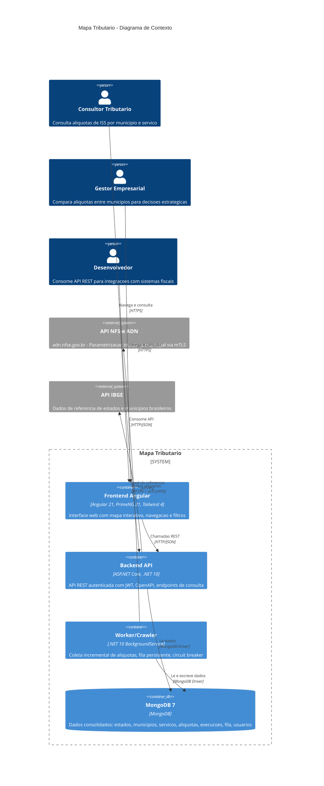
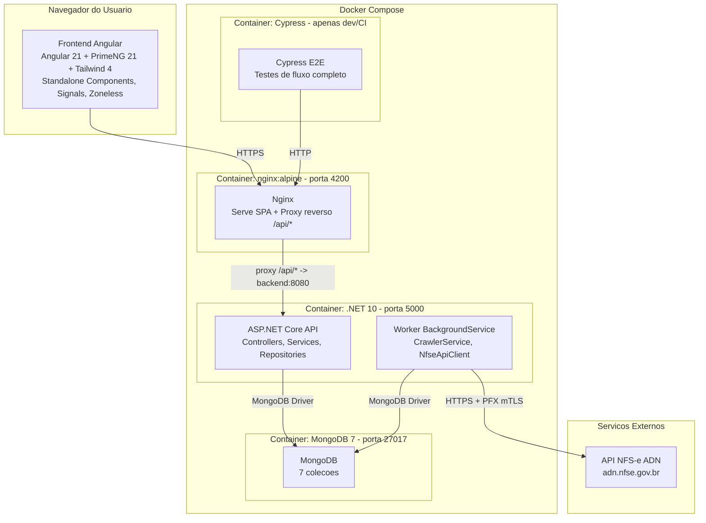
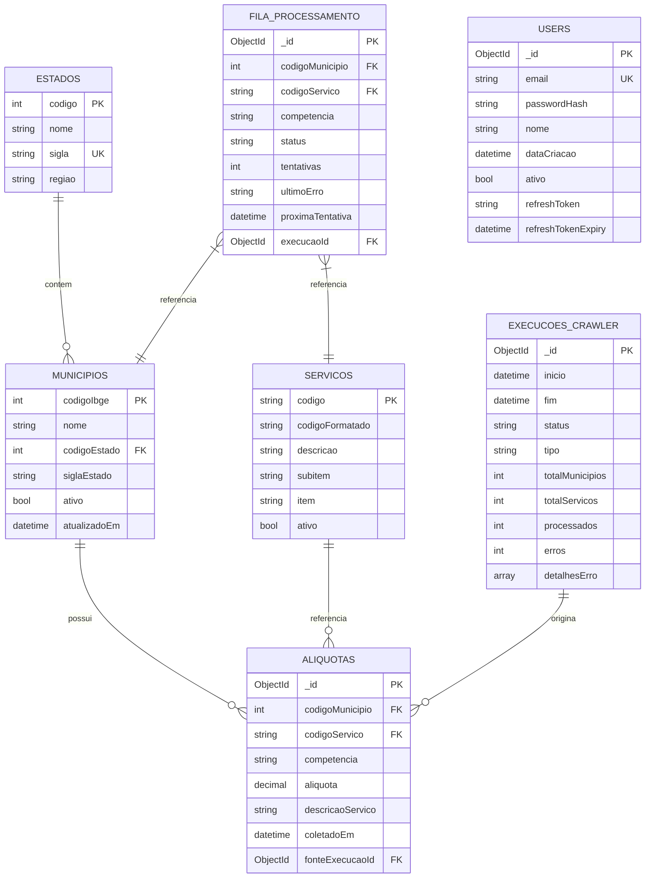
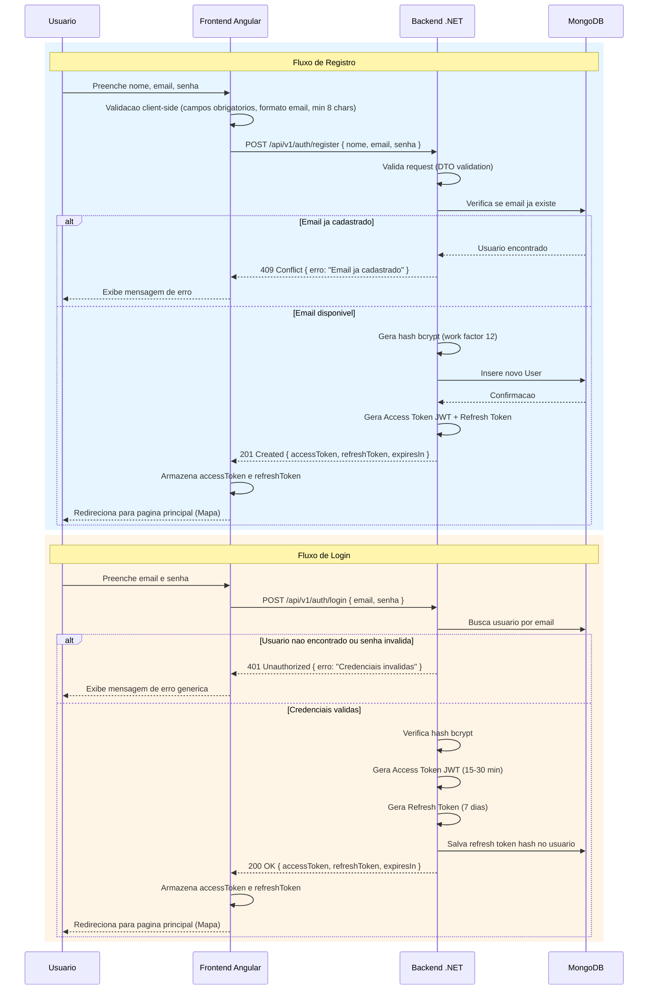
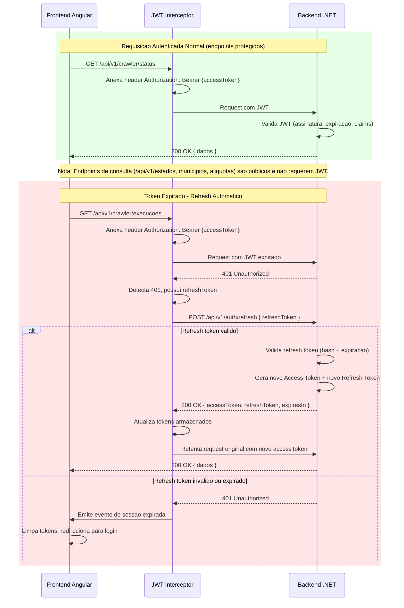
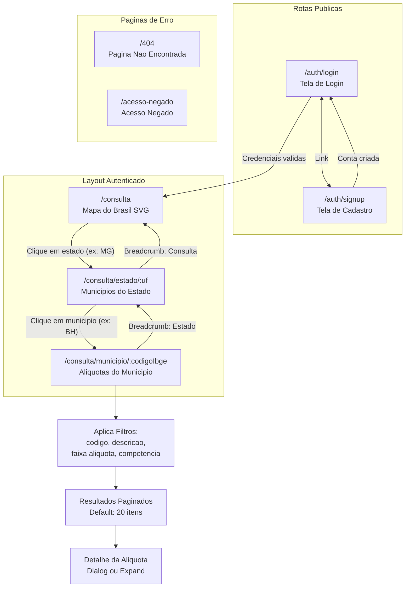
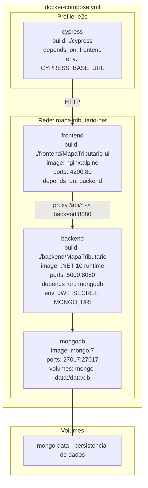

# Documentacao Tecnica - Mapa Tributario

## 1. Arquitetura Geral

### 1.1 Diagrama de Contexto (C4 - Nivel 1)



### 1.2 Diagrama de Containers (C4 - Nivel 2)



---

## 2. Stack Tecnologica

### 2.1 Tabela Completa

| Camada | Tecnologia | Versao | Justificativa |
|--------|-----------|--------|---------------|
| **Frontend** | Angular | 21 | Framework maduro para SPAs complexas; suporte a standalone components, signals e zoneless change detection |
| **UI Components** | PrimeNG | 21 | Biblioteca rica de componentes UI para Angular |
| **CSS Framework** | Tailwind CSS | 4 | Utility-first; alta produtividade; boa integracao com PrimeNG via tailwindcss-primeui |
| **Backend** | ASP.NET Core | .NET 10 | Framework performatico para APIs REST; excelente tooling para OpenAPI |
| **Linguagem Backend** | C# | 13 | Tipagem forte, records, pattern matching; produtividade alta para dominio empresarial |
| **Worker** | .NET BackgroundService | .NET 10 | Compartilha dominio e infra com backend; simplifica deploy (mesmo container) |
| **Banco de Dados** | MongoDB | 7 | Schema flexivel para dados tributarios variados; bom para leitura rapida com indices compostos |
| **Driver MongoDB** | MongoDB.Driver | 3.x | Driver oficial C# para MongoDB; suporte a LINQ e builders |
| **Autenticacao** | JWT (RFC 7519) | - | Stateless; bem suportado pelo ASP.NET Core; access + refresh tokens |
| **Hash de Senhas** | bcrypt | - | Padrao da industria; work factor configuravel; resistente a ataques de forca bruta |
| **Logs** | Microsoft.Extensions.Logging | built-in | ILogger nativo do .NET; logs estruturados em JSON; configuravel via appsettings |
| **Documentacao API** | OpenAPI | 3.0 | Documentacao viva gerada a partir do codigo; endpoint em `/openapi/v1.json` |
| **Testes Backend** | xUnit | latest | Padrao .NET; suporte a injecao de dependencia e paralelismo |
| **Testes Frontend** | Vitest | 4.x | Rapido; ja configurado no projeto Angular |
| **E2E Tests** | Cypress | 13.x | DX excelente para testes de UI; seletores estaveis; bom suporte a SPA |
| **Servidor Web** | Nginx | alpine | Embutido no container frontend (multi-stage build); serve SPA Angular; proxy reverso para backend |
| **Containerizacao** | Docker | - | Ambiente reprodutivel; multi-stage builds para imagens otimizadas |
| **Orquestracao** | Docker Compose | v2 | Orquestracao local simples; define servicos, redes, volumes |
| **Controle de Versao** | Git | - | Estrategia de micro PRs; worktrees por trilha |

### 2.2 Justificativas Arquiteturais Chave

**Por que MongoDB ao inves de PostgreSQL?**
- Dados da API NFS-e tem estrutura variavel (campos opcionais, formatos inconsistentes)
- Schema flexivel facilita evolucao sem migrations
- Indices compostos em `aliquotas` atendem os padroes de consulta do frontend
- Boa performance para leitura em escala (dados materializados)

**Por que Worker no mesmo container do Backend?**
- Worker compartilha modelos de dominio, repositorios e configuracao do MongoDB
- Simplifica deploy e configuracao (um unico Dockerfile .NET)
- Pode ser separado futuramente com Docker profiles ou imagens distintas
- Para o MVP, a complexidade de microsservicos separados nao se justifica

**Por que SVG inline ao inves de biblioteca de mapas?**
- Mapa do Brasil com 27 estados e relativamente simples
- SVG inline permite controle total de estilos, hover e click
- Evita dependencias pesadas (Leaflet, D3, Google Maps)
- Performance superior: nao requer carregamento de tiles ou WebGL

---

## 3. Modelo de Dados MongoDB

### 3.1 Visao Geral das Colecoes



### 3.2 Detalhamento por Colecao

#### `estados`

Armazena os 27 estados brasileiros. Dados estaticos carregados via seed.

| Campo | Tipo | Descricao | Exemplo |
|-------|------|-----------|---------|
| `codigo` | int | Codigo IBGE do estado (PK) | `31` |
| `nome` | string | Nome completo do estado | `"Minas Gerais"` |
| `sigla` | string | Sigla do estado (UF, 2 chars) | `"MG"` |
| `regiao` | string | Regiao geografica | `"Sudeste"` |

**Indices:**
- `{ codigo: 1 }` - unique
- `{ sigla: 1 }` - unique (busca por UF nos endpoints)

---

#### `municipios`

Armazena todos os municipios brasileiros (~5.570). Dados carregados via seed IBGE.

| Campo | Tipo | Descricao | Exemplo |
|-------|------|-----------|---------|
| `codigoIbge` | int | Codigo IBGE do municipio (PK, 7 digitos) | `3106200` |
| `nome` | string | Nome do municipio | `"Belo Horizonte"` |
| `codigoEstado` | int | Codigo IBGE do estado (FK) | `31` |
| `siglaEstado` | string | Sigla do estado | `"MG"` |
| `ativo` | bool | Se o municipio possui convenio NFS-e ativo | `true` |
| `atualizadoEm` | datetime | Ultima verificacao de convenio | `2026-03-15T02:00:00Z` |

**Indices:**
- `{ codigoIbge: 1 }` - unique
- `{ codigoEstado: 1, nome: 1 }` - busca por estado + ordenacao por nome
- `{ siglaEstado: 1 }` - filtro por UF
- `{ ativo: 1 }` - filtro para worker (apenas municipios ativos)

---

#### `servicos`

Codigos de servico da LC 116/2003. Dados carregados via seed.

| Campo | Tipo | Descricao | Exemplo |
|-------|------|-----------|---------|
| `codigo` | string | Codigo numerico sem pontos (PK) | `"010101001"` |
| `codigoFormatado` | string | Codigo com pontos para exibicao | `"01.01.01.001"` |
| `descricao` | string | Descricao do servico | `"Analise e desenvolvimento de sistemas"` |
| `subitem` | string | Subitem na lista LC 116 | `"01.01"` |
| `item` | string | Item na lista LC 116 | `"01"` |
| `ativo` | bool | Se o servico esta ativo na lista | `true` |

**Indices:**
- `{ codigo: 1 }` - unique
- `{ subitem: 1 }` - busca por subitem
- `{ descricao: "text" }` - busca textual por descricao

---

#### `aliquotas`

Colecao principal com dados consolidados de aliquotas. Escrita pelo worker, lida pelo backend.

| Campo | Tipo | Descricao | Exemplo |
|-------|------|-----------|---------|
| `_id` | ObjectId | Identificador interno do MongoDB | - |
| `codigoMunicipio` | int | Codigo IBGE do municipio (FK) | `3106200` |
| `codigoServico` | string | Codigo do servico sem pontos (FK) | `"010101001"` |
| `competencia` | string | Competencia no formato `YYYYMM` | `"202603"` |
| `aliquota` | decimal | Percentual da aliquota | `3.00` |
| `descricaoServico` | string | Descricao do servico (denormalizado) | `"Analise e desenvolvimento de sistemas"` |
| `coletadoEm` | datetime | Timestamp da coleta | `2026-03-15T02:35:12Z` |
| `fonteExecucaoId` | ObjectId | ID da execucao do crawler que coletou (FK) | - |
| `dadosBrutos` | object | Resposta original da API NFS-e (opcional, para auditoria) | `{ ... }` |

**Indices:**
- `{ codigoMunicipio: 1, codigoServico: 1, competencia: 1 }` - **unique compound** (chave natural)
- `{ codigoMunicipio: 1, competencia: 1 }` - listagem de aliquotas por municipio e competencia
- `{ codigoServico: 1 }` - filtro por servico
- `{ aliquota: 1 }` - filtro por faixa de aliquota
- `{ coletadoEm: -1 }` - ordenacao por data de coleta (mais recente primeiro)

---

#### `execucoesCrawler`

Historico de execucoes do worker/crawler.

| Campo | Tipo | Descricao | Exemplo |
|-------|------|-----------|---------|
| `_id` | ObjectId | Identificador da execucao | - |
| `inicio` | datetime | Timestamp de inicio | `2026-03-15T02:00:00Z` |
| `fim` | datetime | Timestamp de finalizacao (null se em andamento) | `2026-03-15T04:23:45Z` |
| `status` | string | `em_andamento`, `concluido`, `falha_parcial`, `falha` | `"concluido"` |
| `tipo` | string | `agendado` ou `manual` | `"agendado"` |
| `competencia` | string | Competencia processada | `"202603"` |
| `totalMunicipios` | int | Total de municipios na fila | `45` |
| `totalServicos` | int | Total de combinacoes municipio+servico | `2700` |
| `processados` | int | Itens processados com sucesso | `2650` |
| `erros` | int | Itens com erro | `50` |
| `detalhesErro` | array | Lista de erros relevantes | `[{ municipio: "3106200", servico: "010101001", erro: "timeout", tentativas: 3 }]` |
| `circuitBreakerAtivado` | bool | Se o circuit breaker foi ativado | `false` |
| `duracaoSegundos` | int | Duracao total em segundos | `8625` |

**Indices:**
- `{ inicio: -1 }` - ordenacao para historico (mais recente primeiro)
- `{ status: 1 }` - busca por execucoes em andamento

---

#### `filaProcessamento`

Fila de trabalho do worker. Permite retomada e reprocessamento.

| Campo | Tipo | Descricao | Exemplo |
|-------|------|-----------|---------|
| `_id` | ObjectId | Identificador do item na fila | - |
| `codigoMunicipio` | int | Codigo IBGE do municipio | `3106200` |
| `codigoServico` | string | Codigo do servico sem pontos | `"010101001"` |
| `competencia` | string | Competencia alvo | `"202603"` |
| `status` | string | `pendente`, `processando`, `concluido`, `erro` | `"pendente"` |
| `tentativas` | int | Numero de tentativas realizadas | `0` |
| `ultimoErro` | string | Descricao do ultimo erro (null se sem erro) | `"Connection timeout"` |
| `proximaTentativa` | datetime | Quando tentar novamente (null se concluido) | `2026-03-15T02:01:30Z` |
| `execucaoId` | ObjectId | ID da execucao a que pertence | - |
| `criadoEm` | datetime | Quando o item foi adicionado a fila | `2026-03-15T02:00:00Z` |
| `processadoEm` | datetime | Quando o item foi processado com sucesso | `2026-03-15T02:00:45Z` |

**Indices:**
- `{ status: 1, proximaTentativa: 1 }` - busca de itens prontos para processamento
- `{ execucaoId: 1, status: 1 }` - metricas por execucao
- `{ codigoMunicipio: 1, codigoServico: 1, competencia: 1 }` - unique por execucao

---

#### `users`

Usuarios autenticados da aplicacao.

| Campo | Tipo | Descricao | Exemplo |
|-------|------|-----------|---------|
| `_id` | ObjectId | Identificador do usuario | - |
| `email` | string | Email do usuario (unique) | `"ana@empresa.com"` |
| `passwordHash` | string | Hash bcrypt da senha | `"$2b$12$..."` |
| `nome` | string | Nome completo | `"Ana Silva"` |
| `dataCriacao` | datetime | Data de criacao da conta | `2026-03-10T14:00:00Z` |
| `ativo` | bool | Se a conta esta ativa | `true` |
| `refreshToken` | string | Token de refresh atual (hash) | `"abc123..."` |
| `refreshTokenExpiry` | datetime | Expiracao do refresh token | `2026-03-17T14:00:00Z` |

**Indices:**
- `{ email: 1 }` - unique (login e validacao de unicidade)
- `{ refreshToken: 1 }` - busca para validacao de refresh

---

## 4. Fluxo de Autenticacao JWT

### 4.1 Registro e Login



### 4.2 Refresh Token e Requisicoes Autenticadas



### 4.3 Estrutura do JWT

**Header:**
```json
{
  "alg": "HS256",
  "typ": "JWT"
}
```

**Payload:**
```json
{
  "sub": "ObjectId do usuario",
  "email": "ana@empresa.com",
  "nome": "Ana Silva",
  "iat": 1743379200,
  "exp": 1743381000,
  "iss": "mapa-tributario-api",
  "aud": "mapa-tributario-frontend"
}
```

**Configuracoes:**

| Parametro | Valor | Descricao |
|-----------|-------|-----------|
| Access Token TTL | 15-30 min | Configuravel via `appsettings.json` |
| Refresh Token TTL | 7 dias | Renovado a cada uso |
| Algoritmo | HS256 | HMAC SHA-256 |
| Secret | env var `JWT_SECRET` | Minimo 256 bits |
| Issuer | `mapa-tributario-api` | Identificador do emissor |
| Audience | `mapa-tributario-frontend` | Identificador do consumidor |

---

## 5. Fluxo do Worker/Crawler

### 5.1 Ciclo de Execucao Completo

```mermaid
flowchart TD
    START([Inicio do Ciclo]) --> CHECK_TRIGGER{Trigger?}
    CHECK_TRIGGER -->|CRON agendado| CRON[CRON Schedule<br/>Default: diario 02:00 UTC]
    CHECK_TRIGGER -->|Manual via API| MANUAL["POST /api/v1/crawler/executar"]

    CRON --> CHECK_RUNNING{Ja existe ciclo<br/>em andamento?}
    MANUAL --> CHECK_RUNNING

    CHECK_RUNNING -->|Sim| REJECT[Rejeita: 409 Conflict]
    CHECK_RUNNING -->|Nao| CREATE_EXEC["Cria registro em<br/>execucoesCrawler<br/>status: em_andamento"]

    CREATE_EXEC --> CHECK_QUEUE{Fila com itens<br/>pendentes ou erro?}

    CHECK_QUEUE -->|Sim - retomada| PROCESS[Processar fila existente]
    CHECK_QUEUE -->|Nao| DISCOVER[Descoberta de Municipios]

    DISCOVER --> CONVENIO["Para cada municipio:<br/>GET /parametrizacao/{mun}/convenio"]
    CONVENIO --> MARK_ACTIVE{Municipio aderido?}
    MARK_ACTIVE -->|Sim| SET_ACTIVE["Marca municipio.ativo = true"]
    MARK_ACTIVE -->|Nao| SET_INACTIVE["Marca municipio.ativo = false<br/>Skip no ciclo"]

    SET_ACTIVE --> GEN_QUEUE["Gera fila:<br/>municipio x servico x competencia<br/>Skip combinacoes ja coletadas"]
    SET_INACTIVE --> GEN_QUEUE

    GEN_QUEUE --> PROCESS

    PROCESS --> PICK["Busca proximo item:<br/>status=pendente OU<br/>(status=erro AND<br/>proximaTentativa <= agora)"]

    PICK --> HAS_ITEM{Encontrou item?}
    HAS_ITEM -->|Nao| FINISH[Finaliza ciclo]
    HAS_ITEM -->|Sim| CHECK_CB{Circuit Breaker<br/>aberto?}

    CHECK_CB -->|Sim| WAIT_CB["Aguarda periodo<br/>de pausa: 5 min"]
    WAIT_CB --> PROBE[Envia probe request]
    PROBE -->|Sucesso| CLOSE_CB[Fecha circuit breaker]
    PROBE -->|Falha| WAIT_CB
    CLOSE_CB --> SEMAPHORE

    CHECK_CB -->|Nao| SEMAPHORE["Aguarda semaforo<br/>Max 3 concorrentes"]

    SEMAPHORE --> RATE_LIMIT["Rate Limiter<br/>Max 10 req/s"]
    RATE_LIMIT --> SET_PROCESSING["Item status = processando"]
    SET_PROCESSING --> CALL_API["GET /parametrizacao/{mun}/{svc}/{comp}/aliquota<br/>Timeout: 30s<br/>Certificado PFX"]

    CALL_API --> API_RESULT{Resultado?}

    API_RESULT -->|200 OK| UPSERT["Upsert em aliquotas<br/>codigoMunicipio + codigoServico + competencia"]
    UPSERT --> DONE_ITEM["Item status = concluido"]

    API_RESULT -->|404 Not Found| NOT_FOUND["Item status = concluido<br/>Nota: sem dados"]

    API_RESULT -->|5xx / Timeout| TRANSIENT[Erro transitorio]
    TRANSIENT --> INC_RETRY["tentativas++"]
    INC_RETRY --> MAX_RETRY{tentativas >= 3?}
    MAX_RETRY -->|Sim| PERM_FAIL["Item status = erro<br/>Falha permanente"]
    MAX_RETRY -->|Nao| CALC_BACKOFF["Calcula backoff:<br/>1a: 30s<br/>2a: 2min<br/>3a: 8min"]
    CALC_BACKOFF --> SET_RETRY["Item status = erro<br/>proximaTentativa = agora + backoff"]

    API_RESULT -->|"4xx (exceto 404)"| PERM_ERROR["Erro permanente<br/>Nao faz retry"]
    PERM_ERROR --> PERM_FAIL

    DONE_ITEM --> UPDATE_CB["Atualiza metricas<br/>do circuit breaker"]
    PERM_FAIL --> UPDATE_CB
    SET_RETRY --> UPDATE_CB

    UPDATE_CB --> CHECK_CB_THRESHOLD{">50% erros em<br/>1 minuto?"}
    CHECK_CB_THRESHOLD -->|Sim| OPEN_CB["Abre circuit breaker<br/>Log warning"]
    CHECK_CB_THRESHOLD -->|Nao| PICK
    OPEN_CB --> PICK

    FINISH --> UPDATE_EXEC["Atualiza execucoesCrawler:<br/>fim, processados, erros,<br/>status final, duracao"]
    UPDATE_EXEC --> CALC_STATUS{Todos processados?}
    CALC_STATUS -->|Sem erros| STATUS_OK["status = concluido"]
    CALC_STATUS -->|Alguns erros| STATUS_PARTIAL["status = falha_parcial"]
    CALC_STATUS -->|Todos falharam| STATUS_FAIL["status = falha"]
    STATUS_OK --> WAIT_NEXT(["Aguarda proximo ciclo CRON"])
    STATUS_PARTIAL --> WAIT_NEXT
    STATUS_FAIL --> WAIT_NEXT
```



### 5.2 Parametros de Configuracao do Worker

| Parametro | Default | Descricao |
|-----------|---------|-----------|
| `Crawler:CronSchedule` | `0 2 * * *` | CRON para execucao agendada (diario 02:00 UTC) |
| `Crawler:MaxConcurrency` | `3` | Maximo de chamadas simultaneas a API NFS-e |
| `Crawler:RateLimitPerSecond` | `10` | Maximo de requisicoes por segundo |
| `Crawler:TimeoutSeconds` | `30` | Timeout por chamada a API NFS-e |
| `Crawler:MaxRetries` | `3` | Maximo de tentativas por item |
| `Crawler:BackoffSeconds` | `[30, 120, 480]` | Intervalos de backoff por tentativa |
| `Crawler:CircuitBreakerThreshold` | `0.5` | Percentual de erros para abrir circuit breaker (50%) |
| `Crawler:CircuitBreakerWindowSeconds` | `60` | Janela de analise do circuit breaker |
| `Crawler:CircuitBreakerPauseSeconds` | `300` | Duracao da pausa quando circuit breaker abre (5 min) |
| `Crawler:PfxPath` | `/certs/nfse.pfx` | Caminho do certificado PFX no container |
| `Crawler:PfxPassword` | (env var) | Senha do certificado PFX |
| `Crawler:NfseBaseUrl` | `https://adn.nfse.gov.br` | URL base da API NFS-e |
| `Crawler:HistoricalCompetencias` | `[]` | Lista de competencias historicas para coletar |
| `Crawler:MunicipiosIniciais` | capitais | Subconjunto de municipios para o MVP |

### 5.3 Endpoints da API NFS-e Consumidos pelo Worker

| Endpoint | Metodo | Descricao | Uso |
|----------|--------|-----------|-----|
| `/parametrizacao/{municipio}/convenio` | GET | Verifica adesao do municipio ao NFS-e | Descoberta de municipios ativos |
| `/parametrizacao/{municipio}/{servico}/{competencia}/aliquota` | GET | Consulta aliquota especifica | Coleta principal |
| `/parametrizacao/{municipio}/{servico}/historicoaliquotas` | GET | Historico de aliquotas | Coleta historica (configuravel) |
| `/parametrizacao/{municipio}/{servico}/{competencia}/retencoes` | GET | Informacoes de retencao | Uso futuro |
| `/parametrizacao/{municipio}/{servico}/{competencia}/beneficio` | GET | Beneficios fiscais | Uso futuro |
| `/cnc/consulta/cad/{municipio}` | GET | Cadastro de contribuintes | Descoberta de servicos (investigar) |

**Autenticacao:** Todas as chamadas exigem certificado cliente PFX (mTLS). Nao ha token ou API key.

---

## 6. Fluxo do Usuario

### 6.1 Navegacao Completa



### 6.2 Mapa de Rotas

| Rota | Componente | Guard | Layout | Descricao |
|------|-----------|-------|--------|-----------|
| `/auth/login` | LoginComponent | - | Sem layout | Tela de login |
| `/auth/signup` | SignupComponent | - | Sem layout | Tela de cadastro |
| `/consulta` | MapaComponent | - | AppLayout | Mapa do Brasil |
| `/consulta/estado/:uf` | EstadoComponent | - | AppLayout | Municipios do estado |
| `/consulta/municipio/:codigoIbge` | MunicipioComponent | - | AppLayout | Aliquotas do municipio |
| `/acesso-negado` | AccessDeniedComponent | - | Sem layout | Erro 403 |
| `/404` | NotFoundComponent | - | Sem layout | Erro 404 |
| `**` | redirect para `/404` | - | - | Wildcard |

### 6.3 Estados Visuais

Todas as paginas de consulta implementam os seguintes estados:

| Estado | Componente | Comportamento |
|--------|-----------|---------------|
| **Loading** | `LoadingSpinner` | Exibido enquanto aguarda resposta da API |
| **Sucesso** | Conteudo da pagina | Dados exibidos normalmente com timestamp de atualizacao |
| **Vazio** | `EmptyState` | "Nenhum resultado encontrado" + sugestao de acao |
| **Erro** | `ErrorState` | Mensagem de erro + botao "Tentar novamente" (retry) |

---

## 7. Estrategia de Deploy

### 7.1 Docker Compose - Servicos



### 7.2 Dockerfiles

**Backend (.NET 10 - Multi-stage):**

```
Stage 1 - Build:
  FROM mcr.microsoft.com/dotnet/sdk:10.0
  WORKDIR /src
  COPY *.csproj -> dotnet restore
  COPY . -> dotnet publish -c Release

Stage 2 - Runtime:
  FROM mcr.microsoft.com/dotnet/aspnet:10.0
  COPY --from=build /app/publish .
  EXPOSE 8080
  ENTRYPOINT ["dotnet", "MapaTributario.Api.dll"]
```

**Frontend (Angular 21 - Multi-stage):**

```
Stage 1 - Build:
  FROM node:22-alpine
  WORKDIR /app
  COPY package*.json -> npm ci
  COPY . -> npx ng build --configuration production

Stage 2 - Serve:
  FROM nginx:alpine
  COPY --from=build /app/dist/mapa-tributario-ui/browser /usr/share/nginx/html
  COPY nginx.conf /etc/nginx/conf.d/default.conf
  EXPOSE 80
```

### 7.3 Nginx - Configuracao do Proxy Reverso

> **Nota:** O Nginx nao e um container separado no docker-compose atual. Ele faz parte do container `frontend`, que usa a imagem `nginx:alpine` no segundo estagio do build multi-stage para servir a SPA Angular e atuar como proxy reverso para o backend. Em producao, pode-se optar por um Nginx externo ou outro reverse proxy.

```
server {
    listen 80;

    location /api/ {
        proxy_pass http://backend:8080/api/;
        proxy_set_header Host $host;
        proxy_set_header X-Real-IP $remote_addr;
    }

    location /openapi {
        proxy_pass http://backend:8080/openapi;
    }

    location /health {
        proxy_pass http://backend:8080/health;
    }

    location / {
        root /usr/share/nginx/html;
        index index.html;
        try_files $uri $uri/ /index.html;  # SPA fallback
    }
}
```

### 7.4 Variaveis de Ambiente

| Variavel | Container | Descricao | Exemplo |
|----------|-----------|-----------|---------|
| `MONGO_URI` | backend | Connection string MongoDB | `mongodb://mongodb:27017/mapatributario` |
| `JWT_SECRET` | backend | Segredo para assinar JWT (min 256 bits) | `super-secret-key-256-bits-minimum...` |
| `JWT_EXPIRY_MINUTES` | backend | TTL do access token | `30` |
| `JWT_REFRESH_EXPIRY_DAYS` | backend | TTL do refresh token | `7` |
| `CRAWLER_CRON` | backend | CRON do worker | `0 2 * * *` |
| _(certificado PFX)_ | backend | Gerenciado via API: `POST/GET/DELETE /api/v1/crawler/certificado` | - |
| `NFSE_BASE_URL` | backend | URL da API NFS-e | `https://adn.nfse.gov.br` |
| `ASPNETCORE_ENVIRONMENT` | backend | Ambiente .NET | `Production` |
| `CYPRESS_BASE_URL` | cypress | URL do frontend para testes | `http://frontend:80` |

### 7.5 Health Checks no Docker Compose

```yaml
services:
  backend:
    healthcheck:
      test: ["CMD", "curl", "-f", "http://localhost:8080/health"]
      interval: 30s
      timeout: 10s
      retries: 3
      start_period: 40s

  mongodb:
    healthcheck:
      test: ["CMD", "mongosh", "--eval", "db.adminCommand('ping')"]
      interval: 30s
      timeout: 10s
      retries: 3
```

### 7.6 Comandos de Operacao

```bash
# Subir todos os servicos
docker compose up -d

# Subir apenas backend + mongodb (sem frontend)
docker compose up -d backend mongodb

# Ver logs do worker
docker compose logs -f backend | grep -i crawler

# Executar testes E2E
docker compose --profile e2e up cypress

# Parar tudo
docker compose down

# Parar e remover volumes (reset completo)
docker compose down -v
```

---

## 8. Padroes de Codigo

### 8.1 Backend .NET - Projeto Unico com Separacao por Pastas

```
backend/MapaTributario/
├── src/
│   └── MapaTributario.API/               # Projeto unico com separacao por camadas via pastas
│       ├── Domain/                        # Camada de Dominio
│       │   ├── Entities/
│       │   │   ├── Estado.cs
│       │   │   ├── Municipio.cs
│       │   │   ├── Servico.cs
│       │   │   ├── Aliquota.cs
│       │   │   ├── User.cs
│       │   │   ├── ExecucaoCrawler.cs
│       │   │   └── FilaProcessamento.cs
│       │   ├── ValueObjects/
│       │   │   ├── CodigoServico.cs       # Normalizacao com/sem pontos
│       │   │   └── Competencia.cs         # Normalizacao de formato YYYYMM
│       │   ├── Enums/
│       │   │   ├── StatusExecucao.cs
│       │   │   ├── StatusFila.cs
│       │   │   └── TipoExecucao.cs
│       │   └── Interfaces/               # Contratos (ports)
│       │       ├── IEstadoRepository.cs
│       │       ├── IMunicipioRepository.cs
│       │       ├── IServicoRepository.cs
│       │       ├── IAliquotaRepository.cs
│       │       ├── IUserRepository.cs
│       │       ├── IExecucaoCrawlerRepository.cs
│       │       ├── IFilaProcessamentoRepository.cs
│       │       └── INfseApiClient.cs
│       │
│       ├── Application/                   # Camada de Aplicacao
│       │   ├── Auth/
│       │   │   ├── AuthService.cs         # Register, Login, Refresh
│       │   │   └── Validators/
│       │   │       ├── RegisterRequestValidator.cs
│       │   │       └── LoginRequestValidator.cs
│       │   ├── Consulta/
│       │   │   └── ConsultaService.cs     # Listagem, Filtros, Paginacao
│       │   ├── Crawler/
│       │   │   ├── CrawlerService.cs      # Orquestracao do crawler
│       │   │   └── ICertificadoStore.cs   # Contrato para armazenamento de certificado PFX
│       │   ├── DTOs/
│       │   │   ├── Auth/
│       │   │   │   ├── RegisterRequest.cs
│       │   │   │   ├── LoginRequest.cs
│       │   │   │   ├── RefreshRequest.cs
│       │   │   │   └── AuthResponse.cs
│       │   │   ├── Consulta/
│       │   │   │   ├── EstadoResponse.cs
│       │   │   │   ├── MunicipioResponse.cs
│       │   │   │   ├── AliquotaResponse.cs
│       │   │   │   ├── AliquotaDetalheResponse.cs
│       │   │   │   └── PaginatedResponse.cs
│       │   │   └── Crawler/
│       │   │       ├── ExecutarCrawlerRequest.cs
│       │   │       ├── ExecucaoResponse.cs
│       │   │       └── StatusCrawlerResponse.cs
│       │   └── Mappings/
│       │       └── MappingExtensions.cs   # Entity -> DTO mappings
│       │
│       ├── Infrastructure/                # Camada de Infraestrutura (adapters)
│       │   ├── Repository/
│       │   │   ├── Mongo/
│       │   │   │   ├── MongoMappings.cs       # Class maps para entidades base
│       │   │   │   ├── CrawlerMongoMappings.cs # Class maps para entidades do crawler
│       │   │   │   └── MongoIndexSetup.cs     # Criacao centralizada de indices (todas as colecoes)
│       │   │   ├── EstadoRepository.cs
│       │   │   ├── MunicipioRepository.cs
│       │   │   ├── ServicoRepository.cs
│       │   │   ├── AliquotaRepository.cs
│       │   │   ├── UserRepository.cs
│       │   │   ├── ExecucaoCrawlerRepository.cs
│       │   │   └── FilaProcessamentoRepository.cs
│       │   ├── External/
│       │   │   └── NfseApiClient.cs       # HttpClient + PFX + mTLS
│       │   ├── Auth/
│       │   │   ├── JwtTokenGenerator.cs
│       │   │   └── PasswordHasher.cs
│       │   ├── Seed/
│       │   │   ├── EstadosSeed.cs         # 27 UFs
│       │   │   ├── MunicipiosSeed.cs      # ~5.570 municipios IBGE
│       │   │   └── ServicosSeed.cs        # Codigos LC 116/2003
│       │   ├── Resilience/
│       │   │   ├── RateLimiter.cs
│       │   │   └── CircuitBreaker.cs
│       │   └── Crawler/
│       │       ├── CertificadoStore.cs    # Armazenamento de certificado PFX em memoria
│       │       └── ExecutionGuard.cs      # Controle de execucao concorrente do crawler
│       │
│       ├── Controllers/
│       │   ├── AuthController.cs
│       │   ├── ConsultaController.cs      # Endpoints publicos (sem [Authorize])
│       │   ├── CrawlerController.cs       # Requer JWT + role Admin
│       │   └── HealthController.cs
│       ├── Middleware/
│       │   └── ErrorHandlingMiddleware.cs
│       ├── Workers/
│       │   └── CrawlerBackgroundService.cs
│       ├── Extensions/                    # DI por camada
│       │   ├── InfrastructureServiceExtensions.cs  # AddMapaTributarioInfrastructure()
│       │   └── ApplicationServiceExtensions.cs     # AddMapaTributarioApplication()
│       ├── Configuration/
│       │   ├── JwtConfiguration.cs
│       │   ├── MongoDbConfiguration.cs
│       │   └── CrawlerConfiguration.cs
│       ├── Program.cs                     # Composicao simplificada: AddInfrastructure + AddApplication
│       └── appsettings.json
│
└── tests/
    ├── MapaTributario.Tests.Unit/
    │   ├── Services/                      # Testes de AuthService, ConsultaService, CrawlerService
    │   ├── Domain/                        # Testes de ValueObjects (CodigoServico, Competencia)
    │   └── Validators/                    # Testes de validadores
    └── MapaTributario.Tests.Integration/
        ├── AuthControllerTests.cs         # Testes de endpoints de autenticacao
        ├── ConsultaControllerTests.cs     # Testes de endpoints publicos de consulta
        └── CrawlerControllerTests.cs      # Testes de endpoints do crawler (requer JWT)
```

**Decisoes arquiteturais relevantes:**

- **Projeto unico com separacao por pastas:** As camadas Domain, Application, Infrastructure e API/Host coexistem em um unico projeto (`MapaTributario.API`). A separacao e logica, via pastas e namespaces. Isso simplifica build e deploy sem sacrificar organizacao.
- **DI por camada:** O `Program.cs` chama `AddMapaTributarioInfrastructure()` (MongoDB, repositorios, auth infra, certificado, seed, API client) e `AddMapaTributarioApplication()` (services, use cases, resiliencia, JWT auth, FluentValidation, background service). Cada extension registra apenas os componentes de sua camada.
- **Indices centralizados:** A classe `MongoIndexSetup` cria todos os indices de todas as 7 colecoes em um unico ponto, chamado na inicializacao via `app.ApplyMongoIndexesAsync()`. Repositorios nao criam indices em seus construtores.
- **Endpoints de consulta publicos:** Os endpoints `/api/v1/estados`, `/api/v1/estados/:uf/municipios`, `/api/v1/municipios/:codigoIbge/aliquotas` e `/api/v1/municipios/:codigoIbge/aliquotas/:codigoServico` nao possuem `[Authorize]`. Apenas endpoints do crawler requerem JWT com role Admin.

### 8.2 Frontend Angular - Feature Modules

```
frontend/MapaTributario-ui/src/app/
├── core/                                # Singletons (providedIn: root)
│   ├── auth/
│   │   ├── auth.service.ts             # Login, register, refresh, logout, token mgmt
│   │   ├── auth.guard.ts               # CanActivateFn: verifica JWT valido
│   │   └── jwt.interceptor.ts          # HttpInterceptorFn: anexa token, trata 401+refresh
│   ├── http/
│   │   ├── error.interceptor.ts        # HttpInterceptorFn: log de erros HTTP, notificacao
│   │   └── loading.interceptor.ts      # HttpInterceptorFn: signal global de loading
│   └── services/
│       └── api.service.ts              # HttpClient base com URL prefix /api/v1
│
├── layout/                              # Layout principal da aplicacao
│   ├── components/
│   │   ├── app-layout.component.ts     # Shell principal (sidebar + content area)
│   │   ├── app-topbar.component.ts     # Topbar: toggle dark mode, nome usuario, logout
│   │   ├── app-sidebar.component.ts    # Sidebar colapsavel (static/overlay)
│   │   ├── app-menu.component.ts       # Menu recursivo com itens configurados
│   │   └── app-footer.component.ts     # Footer com versao e timestamp
│   └── services/
│       └── layout.service.ts           # Signals: menuVisible, overlayActive, darkMode
│
├── shared/                              # Componentes reutilizaveis (nao singletons)
│   ├── components/
│   │   ├── loading-spinner/            # Spinner de carregamento
│   │   ├── empty-state/               # Estado vazio com icone e mensagem
│   │   ├── error-state/               # Estado de erro com botao retry
│   │   ├── page-header/               # Titulo + breadcrumb da pagina
│   │   └── filter-bar/                # Barra de filtros generica
│   ├── directives/
│   └── pipes/
│       └── service-code.pipe.ts        # Formata "010101001" -> "01.01.01.001"
│
├── features/                            # Lazy loaded via loadComponent/loadChildren
│   ├── auth/                            # Rotas publicas (fora do layout autenticado)
│   │   ├── login/
│   │   │   └── login.component.ts      # Formulario email+senha, link signup
│   │   └── signup/
│   │       └── signup.component.ts     # Formulario nome+email+senha+confirmacao
│   ├── consulta/                        # Feature principal de consulta
│   │   ├── mapa/
│   │   │   ├── mapa.component.ts       # Pagina: titulo + mapa + instrucoes
│   │   │   └── brazil-map.component.ts # SVG interativo com hover e click por estado
│   │   ├── estado/
│   │   │   └── estado.component.ts     # Lista de municipios com busca textual
│   │   ├── municipio/
│   │   │   └── municipio.component.ts  # Tabela paginada de aliquotas com filtros
│   │   └── services/
│   │       └── consulta.service.ts     # API calls: estados, municipios, aliquotas
│   └── errors/
│       ├── not-found/
│       │   └── not-found.component.ts  # Pagina 404
│       └── access-denied/
│           └── access-denied.component.ts  # Pagina 403
│
├── design-system/                       # Tokens e tema
│   ├── tokens.scss                     # CSS custom properties (cores, espacamento, tipografia)
│   └── theme.scss                      # Configuracao de tema PrimeNG + dark mode
│
└── app.routes.ts                        # Rotas com lazy loading e guards
```

### 8.3 Padroes Angular Especificos

| Padrao | Descricao |
|--------|-----------|
| **Standalone components** | Sem NgModules; todos os componentes sao standalone (padrao Angular 21) |
| **Signals** | Estado reativo via `signal()`, `computed()`, `effect()` |
| **Zoneless** | Change detection sem Zone.js; melhor performance |
| **Functional guards** | `CanActivateFn` ao inves de classes com interface |
| **Functional interceptors** | `HttpInterceptorFn` ao inves de classes com interface |
| **Lazy loading** | `loadComponent` e `loadChildren` nas rotas |
| **Reactive forms** | FormGroup/FormControl com validadores centralizados |
| **OnPush** | ChangeDetectionStrategy.OnPush em todos os componentes |
| **Injecao via inject()** | Funcao `inject()` ao inves de constructor injection |

---

## 9. Convencoes de Nomeacao

### 9.1 Backend (.NET / C#)

| Elemento | Convencao | Exemplo |
|----------|-----------|---------|
| **Namespaces** | PascalCase, hierarquico | `MapaTributario.Domain.Entities` |
| **Classes** | PascalCase, substantivo | `AliquotaRepository`, `CrawlerService` |
| **Interfaces** | PascalCase com prefixo I | `IAliquotaRepository`, `INfseApiClient` |
| **Metodos** | PascalCase, verbo + substantivo | `BuscarPorMunicipio()`, `GerarFilaDeTrabalho()` |
| **Metodos async** | Sufixo Async | `BuscarPorMunicipioAsync()`, `SalvarAsync()` |
| **Propriedades** | PascalCase | `CodigoMunicipio`, `DataCriacao` |
| **Variaveis locais** | camelCase | `aliquotaResponse`, `totalProcessados` |
| **Campos privados** | _camelCase (com underscore) | `_logger`, `_repository` |
| **Constantes** | PascalCase | `MaxRetries`, `DefaultPageSize` |
| **DTOs** | PascalCase + sufixo Request/Response | `LoginRequest`, `AliquotaResponse` |
| **Controllers** | PascalCase + sufixo Controller | `ConsultaController`, `AuthController` |
| **Enums** | PascalCase, singular | `StatusExecucao.EmAndamento` |
| **Colecoes MongoDB** | camelCase | `execucoesCrawler`, `filaProcessamento` |
| **Arquivos de config** | PascalCase | `CrawlerConfiguration.cs`, `JwtConfiguration.cs` |

### 9.2 Frontend (Angular / TypeScript)

| Elemento | Convencao | Exemplo |
|----------|-----------|---------|
| **Arquivos** | kebab-case + sufixo de tipo | `auth.service.ts`, `brazil-map.component.ts` |
| **Classes** | PascalCase | `AuthService`, `BrazilMapComponent` |
| **Interfaces** | PascalCase (sem prefixo I) | `AliquotaResponse`, `LoginRequest` |
| **Variaveis/funcoes** | camelCase | `accessToken`, `buscarAliquotas()` |
| **Signals** | camelCase (sem prefixo $) | `isLoading`, `menuVisible` |
| **Observables** | camelCase + sufixo $ | `aliquotas$`, `user$` |
| **Seletores de componente** | kebab-case com prefixo app | `app-brazil-map`, `app-loading-spinner` |
| **Rotas** | kebab-case | `/consulta/estado/:uf`, `/auth/login` |
| **CSS custom properties** | kebab-case com prefixo --mt | `--mt-primary`, `--mt-surface-ground` |
| **Atributos data-cy** | kebab-case | `data-cy="btn-login"`, `data-cy="map-state-mg"` |
| **Constantes** | UPPER_SNAKE_CASE | `API_BASE_URL`, `DEFAULT_PAGE_SIZE` |

### 9.3 Git e PRs

| Elemento | Convencao | Exemplo |
|----------|-----------|---------|
| **Branch principal** | `main` | - |
| **Branch de release** | `release/{feature}` | `release/full-stack-aliquotas` |
| **Branch de micro PR** | `{trilha}/{descricao-curta}` | `backend/auth-endpoints`, `frontend/foundation-layout` |
| **Commits** | Conventional Commits (pt-BR) | `feat(backend): adicionar endpoints de autenticacao` |
| **Prefixos de commit** | feat, fix, refactor, test, docs, chore, ci | `fix(worker): corrigir retry apos timeout` |
| **PR title** | `[Trilha] Descricao concisa` | `[Backend] Endpoints de autenticacao JWT` |
| **Endpoints REST** | kebab-case, versionados | `/api/v1/estados/:uf/municipios` |

---

## 10. Decisoes Arquiteturais (ADRs Resumidos)

### ADR-001: Materializacao local vs. consulta real-time

| Item | Descricao |
|------|-----------|
| **Status** | Aceita |
| **Contexto** | A API NFS-e requer certificado PFX, tem latencia variavel e sem SLA documentado |
| **Decisao** | Materializar dados localmente via worker assincrono; backend serve do MongoDB |
| **Alternativas descartadas** | Proxy real-time (latencia + dependencia), cache com TTL (complexidade sem beneficio claro) |
| **Consequencias** | (+) Leitura instantanea, independencia da API externa, controle de atualizacao. (-) Dados podem estar defasados entre execucoes. Mitigacao: exibir timestamp da ultima coleta |

### ADR-002: Worker no mesmo container do Backend

| Item | Descricao |
|------|-----------|
| **Status** | Aceita |
| **Contexto** | Worker compartilha modelos de dominio, repositorios e configuracao MongoDB com o backend |
| **Decisao** | Worker como `IHostedService`/`BackgroundService` no mesmo projeto .NET do backend |
| **Alternativas descartadas** | Projeto separado (duplicacao de dominio, complexidade de deploy), Cloud Functions (vendor lock-in) |
| **Consequencias** | (+) Simplicidade, reutilizacao de codigo, unico Dockerfile. (-) Escala acoplada. Mitigacao: pode separar futuramente com Docker profiles |

### ADR-003: MongoDB como store principal

| Item | Descricao |
|------|-----------|
| **Status** | Aceita |
| **Contexto** | Dados da API NFS-e tem estrutura variavel; sistema e otimizado para leitura |
| **Decisao** | MongoDB 7 como banco principal para todas as colecoes |
| **Alternativas descartadas** | PostgreSQL (rigidez de schema para dados tributarios variados), Redis (persistencia secundaria), Elasticsearch (overengineering para o MVP) |
| **Consequencias** | (+) Schema flexivel, indices compostos performaticos, facil de dockerizar. (-) Sem transacoes ACID complexas (nao necessario). Sem joins nativos (denormalizacao intencional) |

### ADR-004: JWT com refresh token para autenticacao

| Item | Descricao |
|------|-----------|
| **Status** | Aceita |
| **Contexto** | Necessidade de autenticacao simples para o MVP, sem provedores externos |
| **Decisao** | JWT (access token curto + refresh token longo) com bcrypt para senhas |
| **Alternativas descartadas** | Session-based auth (complexidade com cookies em SPA), OAuth2/OpenID Connect (overengineering para MVP) |
| **Consequencias** | (+) Stateless, bem suportado, simples. (-) Token revogacao exige blacklist (nao implementado no MVP). Caminho para evolucao: roles/claims |

### ADR-005: SVG inline para mapa do Brasil

| Item | Descricao |
|------|-----------|
| **Status** | Aceita |
| **Contexto** | Mapa do Brasil com 27 estados e relativamente simples; precisa de hover e click |
| **Decisao** | SVG inline com paths por estado, atributos `data-uf`, interacao via Angular |
| **Alternativas descartadas** | Leaflet/OpenLayers (pesado), D3.js (complexidade desproporcional), Google Maps (custo, overkill) |
| **Consequencias** | (+) Zero dependencias, controle total, performance excelente. (-) Manutencao manual dos paths SVG (estaticos e amplamente disponiveis) |

### ADR-006: Layout PrimeNG como referencia controlada

| Item | Descricao |
|------|-----------|
| **Status** | Aceita |
| **Contexto** | Precisa de layout solido sem construir do zero |
| **Decisao** | Construir layout proprio usando componentes PrimeNG (sidebar, topbar, menu); descartar dependencias de templates externos |
| **Alternativas descartadas** | Construir do zero sem PrimeNG (tempo excessivo), copiar template inteiro externo (divida tecnica massiva) |
| **Consequencias** | (+) Layout proprio e limpo, sem dependencias externas. (-) Mais trabalho inicial. Mitigacao: aproveitar os componentes prontos do PrimeNG |

### ADR-007: Fila de processamento persistente no MongoDB

| Item | Descricao |
|------|-----------|
| **Status** | Aceita |
| **Contexto** | Worker precisa de retomada, reprocessamento e visibilidade do progresso |
| **Decisao** | Colecao `filaProcessamento` no MongoDB como fila de trabalho |
| **Alternativas descartadas** | RabbitMQ/Kafka (infra adicional desnecessaria), fila em memoria (perde progresso), Azure Service Bus (vendor lock-in) |
| **Consequencias** | (+) Retomada automatica, visibilidade total, sem infra adicional. (-) Nao e fila otimizada (polling). Mitigacao: indice em `status + proximaTentativa`. Indices centralizados em `MongoIndexSetup` |

### ADR-008: Codigo de servico armazenado sem pontos

| Item | Descricao |
|------|-----------|
| **Status** | Aceita |
| **Contexto** | Formato inconsistente na API NFS-e: `01.01.01.001` vs `010101001` |
| **Decisao** | Armazenar internamente sem pontos (numerico puro); formatar para exibicao |
| **Alternativas descartadas** | Armazenar com pontos (formato inconsistente na entrada), armazenar ambos (duplicacao) |
| **Consequencias** | (+) Comparacao e indice simples, normalizacao centralizada. (-) Precisa de formatacao na exibicao. Mitigacao: pipe Angular + metodo no backend |

### ADR-009: Competencia como YYYYMM internamente

| Item | Descricao |
|------|-----------|
| **Status** | Aceita |
| **Contexto** | API NFS-e usa data completa `2026-01-09`, README indica `YYYYMM`, competencia e mensal |
| **Decisao** | Armazenar como `YYYYMM`; enviar para API como `YYYY-MM-01` (primeiro dia do mes) |
| **Alternativas descartadas** | Armazenar data completa (granularidade desnecessaria) |
| **Consequencias** | (+) Consistencia, agrupamento natural por mes. (-) Transformacao na entrada e saida para API. Mitigacao: ValueObject `Competencia` no dominio |

### ADR-010: Micro PRs obrigatorios

| Item | Descricao |
|------|-----------|
| **Status** | Aceita |
| **Contexto** | Projeto full stack com multiplas trilhas; revisao por agentes e humanos |
| **Decisao** | 1 PR de release + multiplos micro PRs por trilha (backend, frontend, worker, E2E) |
| **Alternativas descartadas** | PRs grandes misturando camadas, feature branches longas |
| **Consequencias** | (+) Revisao focada, integracao gradual. (-) Overhead de gerenciamento. Mitigacao: checkpoints de integracao definidos |

---

## Historico do Documento

| Data | Versao | Descricao |
|------|--------|-----------|
| 2026-03-31 | 1.0 | Versao inicial do documento tecnico |
