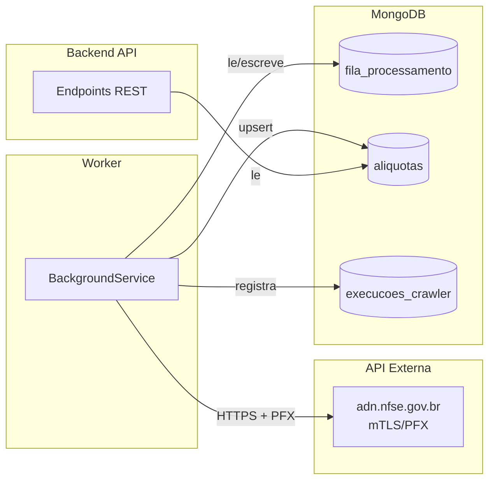
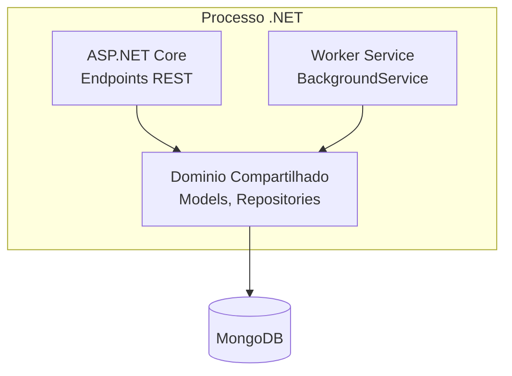
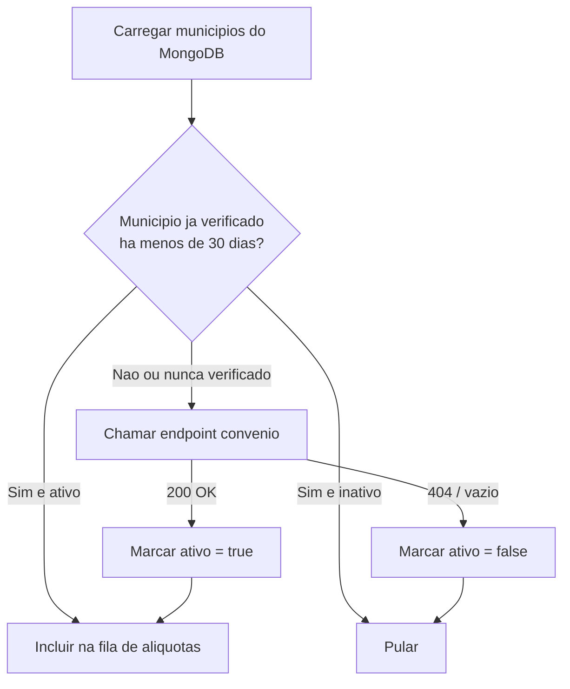
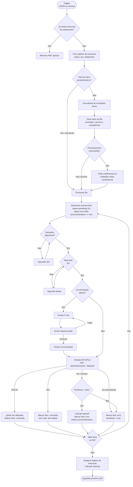
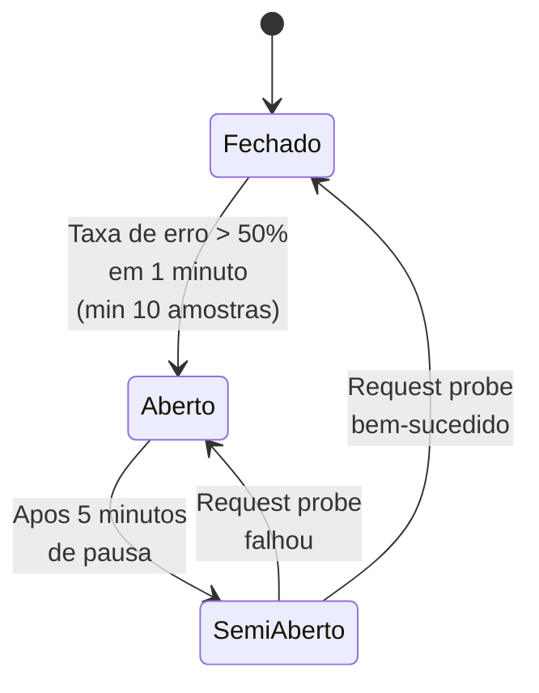
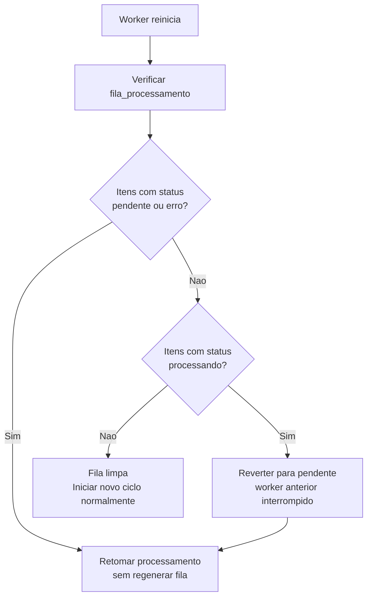
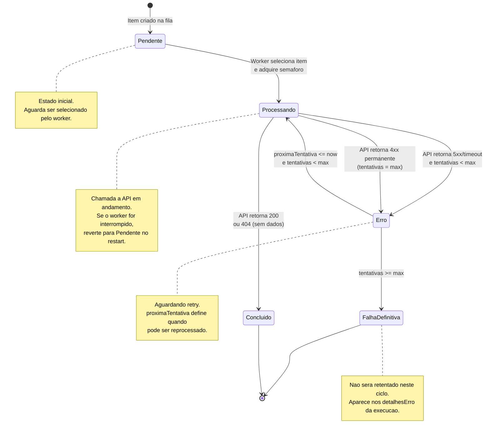
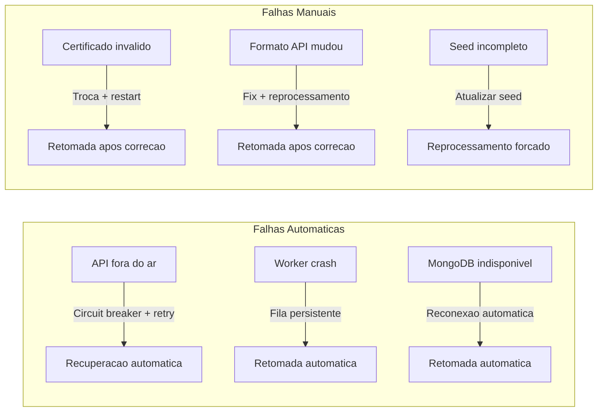

# Estrategia do Worker/Crawler - Mapa Tributario

> Documento tecnico que descreve a estrategia completa do worker responsavel por coletar e consolidar dados de aliquotas da API NFS-e.

---

## Indice

- [Visao Geral](#visao-geral)
- [Justificativa: Por que materializacao local](#justificativa-por-que-materializacao-local)
- [Arquitetura do Worker](#arquitetura-do-worker)
- [Descoberta de Municipios Ativos](#descoberta-de-municipios-ativos)
- [Descoberta e Seed de Codigos de Servico](#descoberta-e-seed-de-codigos-de-servico)
- [Fila de Processamento](#fila-de-processamento)
- [Fluxo de Execucao](#fluxo-de-execucao)
- [Controle de Concorrencia](#controle-de-concorrencia)
- [Rate Limiting](#rate-limiting)
- [Circuit Breaker](#circuit-breaker)
- [Retry com Exponential Backoff](#retry-com-exponential-backoff)
- [Processamento Incremental](#processamento-incremental)
- [Gestao de Competencia](#gestao-de-competencia)
- [Retomada apos Falha](#retomada-apos-falha)
- [Reprocessamento Forcado](#reprocessamento-forcado)
- [Registro de Execucoes](#registro-de-execucoes)
- [Configuracao](#configuracao)
- [Estimativa de Volume](#estimativa-de-volume)
- [Estrategia de MVP](#estrategia-de-mvp)
- [Diagrama de Estados da Fila](#diagrama-de-estados-da-fila)
- [Cenarios de Falha e Recuperacao](#cenarios-de-falha-e-recuperacao)

---

## Visao Geral

O worker e um `BackgroundService` do .NET 10 que roda dentro do mesmo processo do backend ASP.NET Core. Sua responsabilidade principal e coletar aliquotas de ISS da API NFS-e (`adn.nfse.gov.br`) e persisti-las no MongoDB para que o backend sirva os dados ao frontend sem depender da API externa em tempo real.

O worker opera com **materializacao local**: ele coleta dados de forma assincrona, consolida no banco e o backend serve exclusivamente a partir do store local.



---

## Justificativa: Por que materializacao local

A decisao de materializar dados localmente ao inves de consultar a API NFS-e em tempo real foi tomada pelos seguintes motivos:

| Aspecto | Real-time (proxy) | Materializacao local |
|---------|-------------------|---------------------|
| **Latencia para o usuario** | Alta e variavel (depende da API externa) | Baixa e previsivel (leitura do MongoDB local) |
| **Disponibilidade** | Depende da API externa estar no ar | Independente; dados ja coletados continuam disponiveis |
| **Certificado PFX** | Cada requisicao do usuario dispara chamada mTLS | Apenas o worker usa o certificado |
| **Rate limit** | Dificil controlar com multiplos usuarios simultaneos | Worker controla centralizadamente |
| **Custo de rede** | Uma chamada externa por requisicao do usuario | Coleta em lote, uma vez por dia |
| **Enriquecimento** | Dificil agregar dados de multiplas fontes | Worker pode consolidar e enriquecer |

**Trade-off aceito:** Os dados podem estar defasados entre execucoes do worker. O campo `coletadoEm` em cada registro de aliquota permite que o frontend exiba a data da ultima atualizacao, dando transparencia ao usuario.

---

## Arquitetura do Worker

O worker e implementado como um `IHostedService` / `BackgroundService` no mesmo projeto .NET do backend. Isso permite:

- Compartilhamento de modelos de dominio e acesso ao MongoDB
- Deploy simplificado (um unico container)
- Acesso aos mesmos servicos de configuracao e logging
- Possibilidade de separacao futura sem refatoracao significativa



---

## Descoberta de Municipios Ativos

Nem todos os 5.570 municipios brasileiros estao aderidos ao sistema NFS-e. O worker precisa descobrir quais municipios tem convenio ativo antes de tentar coletar aliquotas.

### Fluxo de descoberta

1. Carregar lista completa de municipios da colecao `municipios` (seed IBGE)
2. Para cada municipio, chamar `GET /parametrizacao/{codigoIbge}/convenio`
3. Se a resposta for bem-sucedida (HTTP 200): marcar municipio como `ativo = true`
4. Se a resposta for HTTP 404 ou vazia: marcar municipio como `ativo = false`
5. Apenas municipios ativos entram na fila de coleta de aliquotas

### Frequencia de redescoberta

- Na primeira execucao: verificar todos os municipios do escopo (MVP: capitais)
- Nas execucoes seguintes: verificar apenas municipios marcados como inativos a mais de 30 dias (para detectar novas adesoes)
- Municipios ativos nao sao reverificados a cada ciclo



---

## Descoberta e Seed de Codigos de Servico

Os codigos de servico seguem a tabela da LC 116/2003 (Lei Complementar). O sistema mantem uma colecao `servicos` com seed inicial.

### Seed da LC 116/2003

A tabela da LC 116/2003 define aproximadamente 600 codigos de servico tributaveis por ISS. O seed inicial carrega todos esses codigos com:

- `codigo`: formato numerico puro (ex: `010101001`)
- `codigoFormatado`: formato com pontos (ex: `01.01.01.001`)
- `descricao`: descricao do servico
- `subitem`: subitem da lista

### Estrategia de combinacao

Para cada municipio ativo, o worker gera combinacoes `municipio + servico` para consulta de aliquota. O volume total e controlado pela estrategia de MVP (ver secao [Estrategia de MVP](#estrategia-de-mvp)).

### Uso potencial do endpoint CNC

O endpoint `GET /cnc/consulta/cad/{municipio}` pode retornar informacoes sobre quais servicos o municipio cadastrou. Se confirmado em testes:

- Pode ser usado para reduzir o numero de combinacoes (consultar apenas servicos que o municipio efetivamente oferece)
- Seria chamado uma vez por municipio antes de gerar a fila
- Esta pendente de validacao (ver Open Questions no design.md)

---

## Fila de Processamento

A fila de processamento e persistida na colecao `fila_processamento` do MongoDB. Cada documento representa uma combinacao unica de municipio + servico + competencia a ser consultada.

### Schema do documento

```json
{
  "_id": "ObjectId",
  "codigoMunicipio": 3106200,
  "codigoServico": "010101001",
  "competencia": "2026-03-01",
  "status": "pendente",
  "tentativas": 0,
  "ultimoErro": null,
  "proximaTentativa": null,
  "criadoEm": "2026-03-15T02:00:00Z",
  "atualizadoEm": "2026-03-15T02:00:00Z",
  "execucaoId": "660f1a2b3c4d5e6f7a8b9c0d"
}
```

### Campos

| Campo | Tipo | Descricao |
|-------|------|-----------|
| codigoMunicipio | int | Codigo IBGE do municipio |
| codigoServico | string | Codigo numerico do servico (sem pontos) |
| competencia | string | Competencia no formato YYYY-MM-01 |
| status | string | Estado atual: `pendente`, `processando`, `concluido`, `erro` |
| tentativas | int | Numero de tentativas realizadas |
| ultimoErro | string ou null | Mensagem do ultimo erro |
| proximaTentativa | DateTime ou null | Quando o item pode ser retentado |
| criadoEm | DateTime | Timestamp de criacao do item na fila |
| atualizadoEm | DateTime | Timestamp da ultima atualizacao |
| execucaoId | string | ID da execucao que gerou este item |

### Indices

```
{ codigoMunicipio: 1, codigoServico: 1, competencia: 1 }  -- unique
{ status: 1, proximaTentativa: 1 }                         -- busca de itens a processar
{ execucaoId: 1 }                                          -- agrupamento por execucao
```

---

## Fluxo de Execucao

O fluxo completo de uma execucao do worker, desde o trigger ate a finalizacao:



---

## Controle de Concorrencia

O worker utiliza `SemaphoreSlim` para limitar o numero de chamadas simultaneas a API NFS-e.

### Implementacao

```
SemaphoreSlim _semaphore = new SemaphoreSlim(maxConcurrency); // default: 3
```

### Comportamento

- Antes de cada chamada a API, o worker adquire um slot no semaforo (`WaitAsync`)
- Apos a conclusao (sucesso ou erro), o slot e liberado (`Release`)
- Se todos os slots estao ocupados, novas tasks aguardam ate que um slot seja liberado
- O valor default de 3 e conservador; pode ser ajustado via configuracao

### Justificativa do default

- A API NFS-e nao documenta limite de conexoes simultaneas
- 3 conexoes simultaneas evita sobrecarga na API externa
- Combinado com o rate limit de 10 req/s, oferece throughput suficiente
- Pode ser aumentado progressivamente apos monitoramento

---

## Rate Limiting

O worker impoe um limite maximo de requisicoes por segundo para evitar sobrecarga na API NFS-e.

### Implementacao

- Token bucket ou sliding window counter
- Default: **10 requisicoes por segundo**
- Se o limite for atingido, a proxima requisicao aguarda ate a janela seguinte

### Interacao com concorrencia

O rate limiting atua como um segundo controle alem do semaforo:

```
Cenario: maxConcurrency = 3, rateLimit = 10/s

- Se cada request leva 500ms: 3 slots x 2 req/s = 6 req/s (abaixo do rate limit)
- Se cada request leva 100ms: 3 slots x 10 req/s = 30 req/s (rate limit ativa, reduz para 10/s)
```

O rate limiter garante que mesmo com requests rapidos, o worker nao exceda o limite configurado.

---

## Circuit Breaker

O circuit breaker protege contra cenarios em que a API NFS-e esta instavel ou fora do ar, evitando envio continuo de requests que vao falhar.

### Parametros

| Parametro | Default | Descricao |
|-----------|---------|-----------|
| Janela de avaliacao | 1 minuto | Periodo para calculo da taxa de erro |
| Limiar de abertura | 50% | Percentual de erros que abre o circuito |
| Tempo de pausa | 5 minutos | Duracao do circuito aberto |
| Minimo de amostras | 10 | Minimo de requests na janela para avaliar |

### Estados do circuit breaker



### Comportamento detalhado

1. **Fechado (normal):** Todas as requisicoes passam. O worker registra sucesso/falha em uma janela deslizante de 1 minuto.
2. **Aberto (pausado):** Nenhuma requisicao e enviada a API. O worker loga um warning indicando que o circuit breaker foi ativado. Os itens da fila permanecem com status `pendente` ou `erro` para retomada posterior.
3. **Semi-aberto (probe):** Apos 5 minutos, o worker envia uma unica requisicao de teste (probe). Se bem-sucedida, o circuito fecha e o processamento normal retoma. Se falhar, o circuito reabre por mais 5 minutos.

---

## Retry com Exponential Backoff

Quando uma requisicao a API falha com erro transitorio (5xx, timeout, erro de rede), o worker agenda uma nova tentativa com delay crescente.

### Tabela de delays

| Tentativa | Delay | Timestamp (se falha as 02:00:00) |
|-----------|-------|----------------------------------|
| 1a falha | 30 segundos | proximaTentativa = 02:00:30 |
| 2a falha | 2 minutos | proximaTentativa = 02:02:30 |
| 3a falha | 8 minutos | proximaTentativa = 02:10:30 |
| 3a falha (max) | -- | Marcado como falha definitiva |

### Formula

```
delay = baseDelay * (4 ^ (tentativa - 1))

Onde:
  baseDelay = 30 segundos
  tentativa 1: 30s * 4^0 = 30s
  tentativa 2: 30s * 4^1 = 120s (2 min)
  tentativa 3: 30s * 4^2 = 480s (8 min)
```

### Erros retryable vs. nao retryable

| Tipo | HTTP Status | Acao |
|------|-------------|------|
| Retryable | 5xx, timeout, erro de rede | Incrementa tentativas, agenda retry |
| Nao retryable | 400, 403 | Marca como falha definitiva imediatamente |
| Sem dados | 404 | Marca como concluido (municipio/servico sem dado nao e erro) |

---

## Processamento Incremental

O worker evita reprocessar combinacoes que ja foram coletadas com sucesso na competencia atual.

### Logica de geracao da fila

Ao gerar a fila de trabalho para uma nova execucao:

1. Listar todos os municipios ativos
2. Para cada municipio, combinar com todos os codigos de servico conhecidos
3. Para cada combinacao, verificar se ja existe registro em `aliquotas` com:
   - Mesmo `codigoMunicipio`
   - Mesmo `codigoServico`
   - Mesma `competencia` (competencia atual)
4. Se ja existe: **pular** (nao adicionar a fila)
5. Se nao existe: **adicionar a fila** com status `pendente`

### Verificacao via query

```
// Pseudocodigo
var jaColetados = await aliquotasCollection
    .Find(a => a.Competencia == competenciaAtual)
    .Project(a => new { a.CodigoMunicipio, a.CodigoServico })
    .ToHashSet();

foreach (var combinacao in todasCombinacoes)
{
    if (!jaColetados.Contains(combinacao))
        filaProcessamento.Insert(novoPendente(combinacao));
}
```

Essa abordagem permite que execucoes diarias processem apenas o delta (novos municipios, novos servicos ou itens que falharam anteriormente).

---

## Gestao de Competencia

A competencia e o periodo mensal de referencia para as aliquotas de ISS.

### Formato

- **Interno (MongoDB e worker):** `YYYY-MM-01` (primeiro dia do mes). Ex: `2026-03-01`
- **API NFS-e (path parameter):** `YYYY-MM-DD` (data completa). O worker sempre envia o primeiro dia do mes.
- **Frontend (query parameter):** `YYYYMM`. Ex: `202603`. O backend converte para o formato interno.

### Competencia corrente

O worker calcula a competencia corrente a partir da data atual:

```
competencia = new DateTime(DateTime.UtcNow.Year, DateTime.UtcNow.Month, 1)
// Em marco de 2026: "2026-03-01"
```

### Coleta historica

Quando configurado para coletar dados historicos, o worker utiliza o endpoint `GET /parametrizacao/{municipio}/{servico}/historicoaliquotas` em vez do endpoint de aliquota por competencia. Os resultados sao armazenados com suas respectivas competencias.

A coleta historica e um modo complementar, nao substitui a coleta incremental da competencia corrente.

---

## Retomada apos Falha

A persistencia da fila no MongoDB permite que o worker retome o processamento apos qualquer tipo de interrupcao.

### Cenarios de retomada



### Tratamento de itens "processando" orfaos

Quando o worker inicia e encontra itens com status `processando`, isso indica que uma execucao anterior foi interrompida no meio de uma chamada a API. Esses itens sao revertidos para `pendente` para reprocessamento.

### Registro de execucao interrompida

Se uma execucao existente estava `em_andamento`, o worker atualiza seu status para `falha` com uma nota indicando que foi interrompida. Uma nova execucao e criada para o ciclo de retomada.

---

## Reprocessamento Forcado

O reprocessamento forcado ignora a logica incremental e recria a fila completa.

### Trigger

- Endpoint: `POST /api/v1/crawler/executar` com body `{ "forcarReprocessamento": true }`
- Uso: quando se deseja atualizar todos os dados independente de ja terem sido coletados

### Comportamento

1. Limpar itens da fila com status `concluido` da competencia atual
2. Regenerar a fila completa (todas as combinacoes municipio + servico)
3. Itens com status `erro` que ainda nao atingiram max retries sao mantidos
4. Iniciar processamento normalmente

### Quando usar

- Apos correcao de bug no worker que afetou dados coletados
- Quando ha suspeita de dados desatualizados pela API NFS-e
- Para revalidar dados apos mudanca na legislacao

---

## Registro de Execucoes

Cada ciclo de execucao do worker e registrado na colecao `execucoes_crawler` para rastreabilidade e monitoramento.

### Schema do registro

```json
{
  "_id": "ObjectId",
  "inicio": "2026-03-15T02:00:00Z",
  "fim": "2026-03-15T03:45:22Z",
  "status": "concluido",
  "tipo": "agendado",
  "totalMunicipios": 27,
  "totalServicos": 598,
  "processados": 16146,
  "erros": 12,
  "detalhesErro": [
    {
      "codigoMunicipio": 1302603,
      "codigoServico": "010101001",
      "erro": "Timeout apos 30s",
      "tentativas": 3
    }
  ]
}
```

### Status possiveis

| Status | Descricao |
|--------|-----------|
| `em_andamento` | Execucao em progresso |
| `concluido` | Todos os itens processados (com ou sem erros nao retryable) |
| `falha_parcial` | Execucao concluiu mas ha itens com erro apos max retries |
| `falha` | Execucao interrompida por falha critica ou parada do worker |

### Metricas calculadas ao finalizar

- **totalMunicipios:** Quantidade distinta de municipios na fila
- **totalServicos:** Quantidade distinta de codigos de servico na fila
- **processados:** Total de itens com status `concluido`
- **erros:** Total de itens com status `erro` apos max retries
- **duracao:** Diferenca entre `inicio` e `fim`
- **taxaErro:** `erros / (processados + erros) * 100`

### Retencao

Os registros de execucao sao mantidos indefinidamente. O endpoint `GET /api/v1/crawler/execucoes` retorna apenas os 20 mais recentes por padrao.

---

## Configuracao

Todas as configuracoes do worker sao expostas via `appsettings.json` e podem ser sobrescritas por variaveis de ambiente.

### Parametros configuraveis

```json
{
  "Worker": {
    "CronSchedule": "0 2 * * *",
    "MaxConcurrency": 3,
    "RateLimitPerSecond": 10,
    "RequestTimeoutSeconds": 30,
    "Retry": {
      "MaxAttempts": 3,
      "BaseDelaySeconds": 30,
      "BackoffMultiplier": 4
    },
    "CircuitBreaker": {
      "ErrorThresholdPercent": 50,
      "EvaluationWindowSeconds": 60,
      "PauseDurationSeconds": 300,
      "MinimumSamples": 10
    },
    "MunicipalityRediscoveryDays": 30,
    "EnableHistoricalCollection": false,
    "CertificatePath": "/certs/client.pfx",
    "CertificatePassword": ""
  }
}
```

### Descricao dos parametros

| Parametro | Default | Descricao |
|-----------|---------|-----------|
| CronSchedule | `0 2 * * *` | Expressao CRON para agendamento (default: diario as 02:00 UTC) |
| MaxConcurrency | 3 | Numero maximo de chamadas simultaneas a API NFS-e |
| RateLimitPerSecond | 10 | Maximo de requisicoes por segundo |
| RequestTimeoutSeconds | 30 | Timeout por requisicao individual a API |
| Retry.MaxAttempts | 3 | Maximo de tentativas por item |
| Retry.BaseDelaySeconds | 30 | Delay base para exponential backoff |
| Retry.BackoffMultiplier | 4 | Multiplicador do backoff (30s, 120s, 480s) |
| CircuitBreaker.ErrorThresholdPercent | 50 | Percentual de erro que abre o circuito |
| CircuitBreaker.EvaluationWindowSeconds | 60 | Janela de avaliacao em segundos |
| CircuitBreaker.PauseDurationSeconds | 300 | Duracao da pausa quando circuito abre |
| CircuitBreaker.MinimumSamples | 10 | Minimo de amostras para avaliar o circuito |
| MunicipalityRediscoveryDays | 30 | Dias para reverificar municipios inativos |
| EnableHistoricalCollection | false | Habilitar coleta historica de aliquotas |
| CertificatePath | `/certs/client.pfx` | Caminho do certificado PFX no container |
| CertificatePassword | (vazio) | Senha do certificado PFX (usar secrets em producao) |

### Variaveis de ambiente

Todos os parametros podem ser sobrescritos por variavel de ambiente seguindo a convencao do .NET:

```
Worker__CronSchedule=0 3 * * *
Worker__MaxConcurrency=5
Worker__Retry__MaxAttempts=5
Worker__CircuitBreaker__ErrorThresholdPercent=60
```

---

## Estimativa de Volume

### Numeros de referencia

| Dado | Quantidade |
|------|------------|
| Municipios brasileiros (IBGE) | 5.570 |
| Codigos de servico (LC 116/2003) | ~600 |
| Combinacoes totais (municipio x servico) | ~3.342.000 |
| Municipios com convenio ativo (estimativa) | ~2.000 a 3.000 |
| Combinacoes efetivas estimadas | ~1.200.000 a 1.800.000 |

### Estimativa de tempo (coleta completa)

Com as configuracoes default:

```
Rate limit: 10 req/s
Combinacoes efetivas: ~1.500.000 (estimativa media)
Tempo estimado: 1.500.000 / 10 = 150.000 segundos = ~41 horas

Com MaxConcurrency=3 e requests de ~500ms:
Throughput real: ~6 req/s (limitado pela latencia)
Tempo estimado: 1.500.000 / 6 = ~69 horas
```

Isso confirma que uma coleta completa de todos os municipios e inviavel em um unico ciclo diario. A estrategia de MVP e essencial.

### Estimativa de armazenamento

```
Tamanho medio por documento aliquota: ~500 bytes
1.500.000 documentos: ~750 MB
Com indices: ~1 GB total estimado
```

---

## Estrategia de MVP

Dada a impossibilidade de coletar todos os municipios em um ciclo diario, o MVP adota uma abordagem progressiva.

### Fase 1: Capitais (27 municipios)

```
Municipios: 27 capitais estaduais
Combinacoes: 27 x 600 = ~16.200
Tempo estimado: 16.200 / 10 = ~27 minutos
```

Essa fase e totalmente viavel em um ciclo diario e permite validar toda a infraestrutura do worker.

### Fase 2: Capitais + municipios mais populosos (100 municipios)

```
Municipios: ~100 (capitais + maiores por populacao)
Combinacoes: 100 x 600 = ~60.000
Tempo estimado: 60.000 / 10 = ~100 minutos (~1h40)
```

### Fase 3: Todos os municipios com convenio ativo

```
Municipios: ~2.000 a 3.000
Combinacoes: ~1.200.000 a 1.800.000
Estrategia: processar em multiplos ciclos, priorizando municipios sem dados
```

Para a Fase 3, o processamento incremental e essencial: cada ciclo diario processa apenas o delta (novos municipios ou servicos nao coletados).

### Priorizacao na fila

A fila pode ser ordenada por prioridade:

1. Capitais estaduais (sempre primeiro)
2. Municipios ja consultados por usuarios no frontend (maior relevancia)
3. Municipios por populacao (descendente)
4. Demais municipios ativos

---

## Diagrama de Estados da Fila

Cada item na fila de processamento transita entre os seguintes estados:



### Transicoes detalhadas

| De | Para | Condicao |
|----|------|----------|
| Pendente | Processando | Worker seleciona o item e inicia chamada a API |
| Processando | Concluido | API retorna 200 (dado coletado) ou 404 (municipio/servico sem dado) |
| Processando | Erro | API retorna 5xx, timeout ou erro de rede; tentativas < max |
| Processando | Erro (falha definitiva) | API retorna 4xx permanente (400, 403); tentativas setado para max |
| Erro | Processando | proximaTentativa <= now E tentativas < max |
| Processando | Pendente | Worker reinicia e encontra itens orfaos em `processando` |

---

## Cenarios de Falha e Recuperacao

### Cenario 1: API NFS-e fora do ar

**Sintoma:** Todas as requisicoes retornam 5xx ou timeout.

**Comportamento do worker:**
1. Primeiras falhas: itens sao marcados com `erro` e agendados para retry
2. Apos 50% de falha em 1 minuto (min 10 amostras): circuit breaker abre
3. Worker pausa por 5 minutos
4. Apos pausa: envia request probe
5. Se probe falha: pausa por mais 5 minutos (loop ate sucesso)
6. Se probe sucede: retoma processamento normal

**Recuperacao:** Automatica. Itens pendentes e com erro sao processados quando a API voltar. Nenhuma perda de dados.

---

### Cenario 2: Worker interrompido (crash, restart do container)

**Sintoma:** Worker para abruptamente durante processamento.

**Comportamento na retomada:**
1. Worker inicia e verifica fila
2. Itens com status `processando` sao revertidos para `pendente`
3. Execucao anterior e marcada como `falha`
4. Nova execucao e criada e retoma a fila existente
5. Itens ja concluidos nao sao reprocessados

**Recuperacao:** Automatica no proximo inicio. Nenhuma perda de dados ja persistidos.

---

### Cenario 3: MongoDB indisponivel

**Sintoma:** Worker nao consegue ler/escrever na fila ou na colecao de aliquotas.

**Comportamento:**
1. Excecao ao tentar acessar o MongoDB
2. Worker loga erro critico
3. Worker aguarda e retenta conexao (via health check interno)
4. Nao processa itens enquanto MongoDB estiver fora

**Recuperacao:** Automatica quando MongoDB voltar. O health check do backend (`GET /health`) reflete o estado da conexao.

---

### Cenario 4: Certificado PFX invalido ou expirado

**Sintoma:** Todas as requisicoes a API NFS-e falham com erro de TLS/SSL.

**Comportamento:**
1. Erros de handshake TLS sao tratados como erro transitorio nas primeiras tentativas
2. Circuit breaker abre rapidamente (100% de falha)
3. Worker entra em loop de pausa de 5 minutos com probe

**Recuperacao:** Manual. Requer substituicao do certificado e restart do container. O worker retoma automaticamente apos o restart com certificado valido.

---

### Cenario 5: Formato de resposta da API NFS-e muda

**Sintoma:** API retorna 200 mas o payload nao e parseavel.

**Comportamento:**
1. Erro de desserializacao e tratado como erro nao retryable
2. Item e marcado como falha definitiva
3. Se afeta todos os itens: circuit breaker nao abre (respostas sao 200)
4. Execucao termina com `falha_parcial` e alto numero de erros

**Recuperacao:** Manual. Requer atualizacao do codigo de desserializacao e reprocessamento forcado. Os logs estruturados contem o payload problematico para diagnostico.

---

### Cenario 6: Seed de servicos incompleto

**Sintoma:** Alguns codigos de servico validos nao estao na colecao `servicos`, resultando em aliquotas nao coletadas.

**Comportamento:** O worker simplesmente nao gera itens na fila para codigos ausentes. Nenhum erro e gerado.

**Recuperacao:** Atualizar o seed de servicos (colecao `servicos`) e executar reprocessamento forcado. Os novos codigos serao incluidos na proxima geracao de fila.

---

### Resumo de resiliencia


