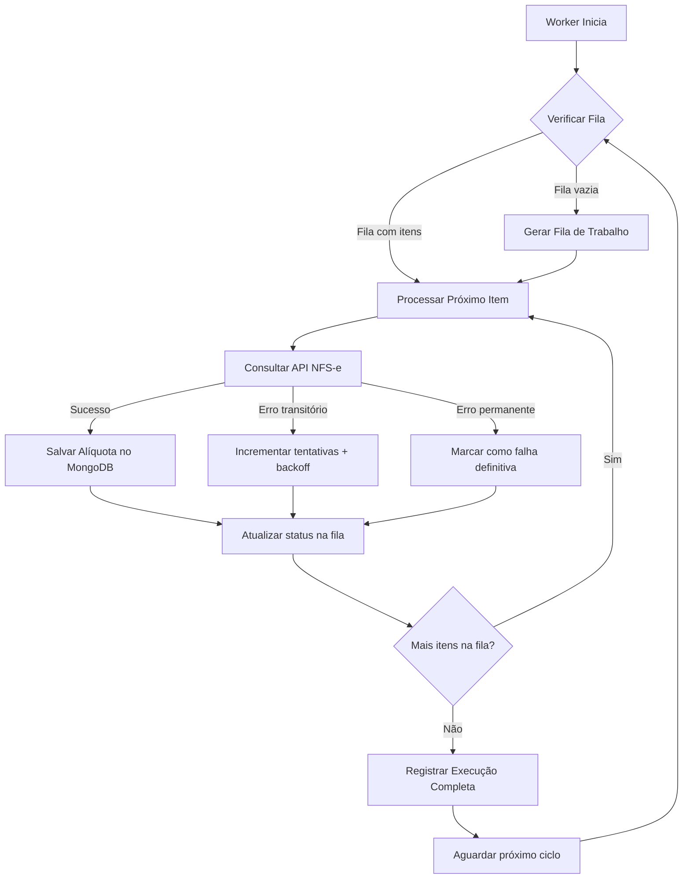
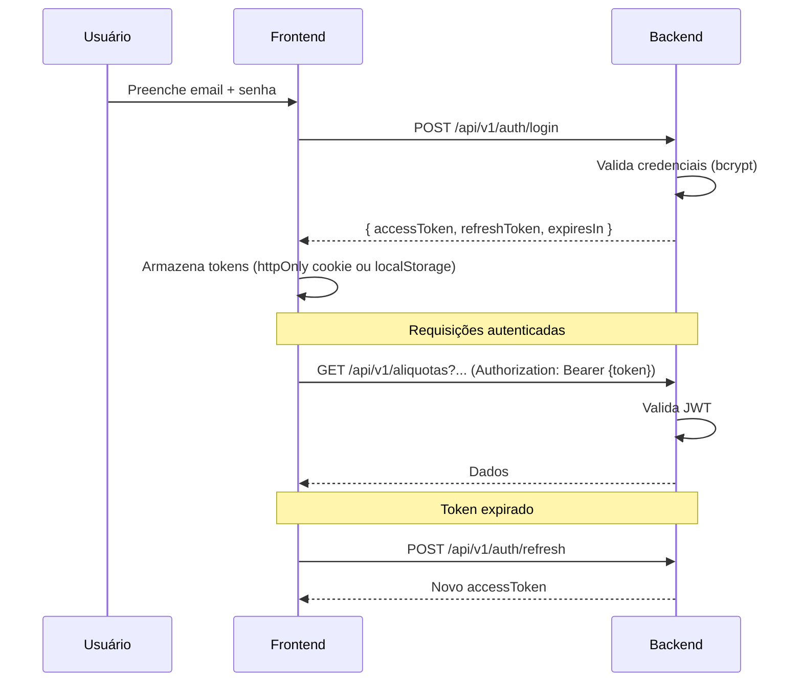
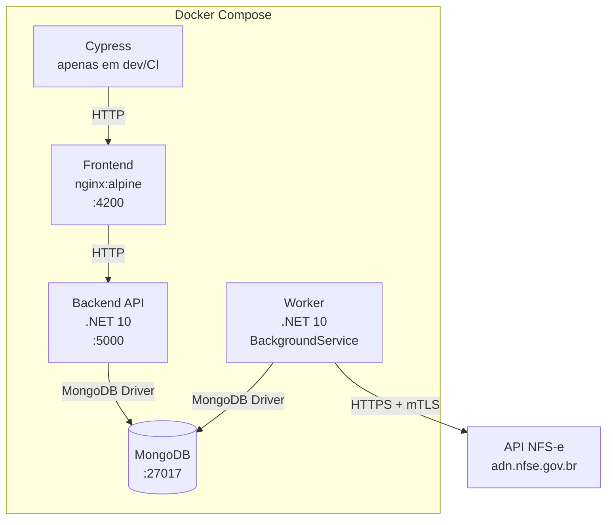
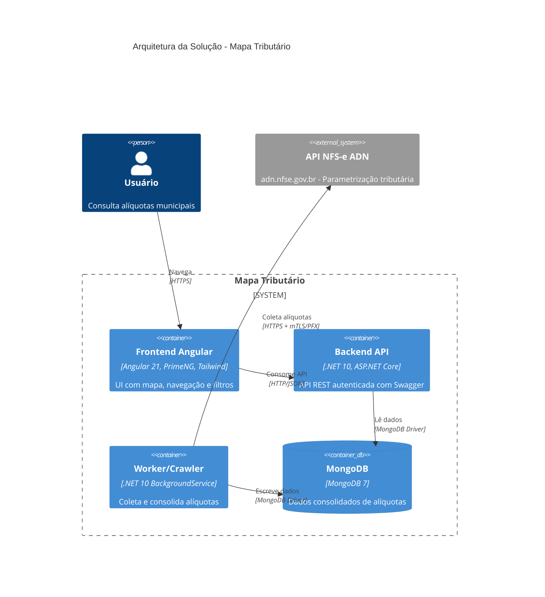
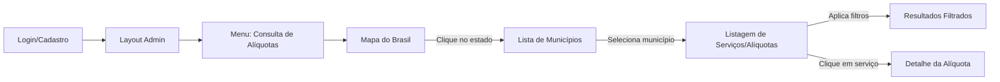

## Context

Este projeto é greenfield — não existe sistema anterior. A motivação é consolidar alíquotas municipais de ISS dispersas na API NFS-e do ADN em uma solução navegável.

**Estado atual:**
- A API NFS-e (`adn.nfse.gov.br`) expõe dados de parametrização tributária por município/serviço/competência
- A API requer certificado cliente PFX para acesso (evidenciado em `context/bruno.json`)
- Não há autenticação por token/API key nos endpoints — apenas mTLS
- Os arquivos Bruno em `context/` documentam 6 endpoints GET: alíquotas, histórico de alíquotas, convênio, retenções, benefício e consulta CNC
- O formato do código de serviço varia: `01.01.01.001` (com pontos) e `010301001` (sem pontos) aparecem nos exemplos
- A competência aparece como data completa (`2026-01-09`) nos Bruno files, mas o README indica formato `YYYYMM` — **premissa: aceitar ambos os formatos e normalizar internamente**
- Existem esqueletos iniciais do backend (.NET 10) e frontend (Angular 21 + PrimeNG 21)
- O template PrimeNG Sakai em `TEMPLATE_FRONT_PATH` usa Angular 21, Tailwind 4, standalone components, signals e zoneless change detection

**Stakeholders:** Equipe de desenvolvimento, usuários finais que precisam consultar alíquotas municipais.

**Constraints:**
- Solução deve ser dockerizada
- PRs devem ser pequenos e revisáveis
- Frontend deve seguir ordem obrigatória (fundação → auth → feature)
- Worker é parte central, não um loop ingênuo
- Documentação deve ser forte para evolução por agentes

---

## Goals / Non-Goals

**Goals:**
- Construir uma solução full stack dockerizada que permita consultar alíquotas de ISS por município e código de serviço
- Materializar dados da API NFS-e localmente para leitura rápida
- Oferecer experiência de navegação visual: mapa → estado → município → serviços/alíquotas
- Implementar autenticação básica viável (JWT) com caminho para evolução
- Garantir que o worker seja resiliente, incremental e retomável
- Manter documentação rastreável e útil para agentes
- Permitir paralelização segura entre trilhas (frontend, backend, worker, E2E)

**Non-Goals:**
- SSO, OAuth2 ou integração com provedores de identidade externos
- Edição ou cadastro de alíquotas pelo usuário (sistema é somente leitura)
- Cobertura de todos os 5.570 municípios no MVP — iniciar somente com 27 capitais
- Notificações push ou real-time via WebSocket
- Multi-tenancy ou isolamento por organização
- Deploy em cloud ou CI/CD pipeline (foco é ambiente local dockerizado)
- Internacionalização (i18n) — aplicação em português

---

## Decisions

### D1: Materialização local vs. consulta real-time à API NFS-e

**Decisão:** Materialização local com worker assíncrono.

**Alternativas consideradas:**
1. **Proxy real-time**: Frontend → Backend → API NFS-e em tempo real
2. **Cache com TTL**: Consulta real-time com cache temporário
3. **Materialização local**: Worker coleta e persiste; backend serve do store local

**Justificativa:** A API NFS-e requer certificado PFX, tem latência variável e não há garantia de SLA. Materialização local oferece: leitura instantânea para o frontend, independência da disponibilidade da API externa, controle total sobre a frequência de atualização, e possibilidade de enriquecimento dos dados (descrições de serviço, metadados).

**Trade-off:** Dados podem estar defasados entre execuções do worker. Mitigação: registrar timestamp da última atualização e exibir no frontend.

---

### D2: Stack tecnológica

**Decisão:**
| Camada | Tecnologia | Justificativa |
|--------|-----------|---------------|
| Frontend | Angular 21 + PrimeNG 21 + Tailwind 4 | Já definido no projeto; template Sakai como referência |
| Backend | ASP.NET Core (.NET 10) + C# | Já definido no projeto; esqueleto existente |
| Worker | ASP.NET Core Background Service (mesmo projeto) | Compartilha domínio/infra com backend; simplifica deploy |
| Database | MongoDB | Esqueleto já aponta para Mongo; schema flexível para dados tributários variados |
| Auth | JWT com refresh token | Simples, stateless, bem suportado pelo .NET |
| E2E | Cypress (projeto separado) | Já definido; boa DX para testes de UI |
| Infra | Docker Compose | Orquestração local simples |

**Alternativa considerada para Worker:** Projeto separado. Descartada porque o worker compartilha modelos de domínio e acesso ao MongoDB com o backend. Manter no mesmo projeto .NET como `IHostedService` / BackgroundService simplifica significativamente.

---

### D3: Modelo de dados MongoDB

**Decisão:** Coleções otimizadas para leitura rápida.

```
Collections:
├── estados              # 27 documentos (UFs brasileiras)
│   { codigo, nome, sigla, regiao }
│
├── municipios           # ~5.570 documentos (IBGE)
│   { codigoIbge, nome, codigoEstado, siglaEstado, ativo }
│
├── servicos             # Códigos de serviço LC 116/2003
│   { codigo, codigoFormatado, descricao, subitem }
│
├── aliquotas            # Dados consolidados (documento principal)
│   { codigoMunicipio, codigoServico, competencia,
│     aliquota, descricaoServico, coletadoEm,
│     fonteExecucaoId }
│   índices: { codigoMunicipio+codigoServico+competencia: unique }
│
├── execucoes_crawler    # Registro de execuções do worker
│   { id, inicio, fim, status, tipo,
│     totalMunicipios, totalServicos,
│     processados, erros, detalhesErro[] }
│
└── fila_processamento   # Fila de trabalho do worker
    { codigoMunicipio, codigoServico, competencia,
      status, tentativas, ultimoErro, proximaTentativa }
```

**Justificativa:** MongoDB permite schema flexível para acomodar variações nos dados da API NFS-e. Índices compostos em `aliquotas` garantem leitura rápida por município+serviço. A coleção `fila_processamento` permite retomada e reprocessamento sem depender de estado em memória.

---

### D4: Estratégia do Worker/Crawler

**Decisão:** Worker como BackgroundService com fila persistente e processamento incremental.

**Fluxo do Worker:**



**Controles:**
- **Concorrência**: Semáforo configurável (default: 2 chamadas simultâneas — conservador para proteger o certificado)
- **Rate limiting**: Max 5 req/s para a API NFS-e (configurável — conservador por padrão)
- **Retry**: Exponential backoff com max 3 tentativas por item
- **Circuit breaker**: Se >50% das chamadas falharem em 1 minuto, pausar por 5 minutos
- **Timeout**: 30s por chamada à API NFS-e
- **Pausa entre batches**: A cada 50 itens processados, pausar 30s (protege o certificado)
- **Budget diário**: Max 50.000 requests/dia — após atingir, aguarda o próximo ciclo
- **Throttling adaptativo**: Se response time médio > 5s ou receber 429/403, reduz para 1 req/s e pausa 2min entre batches
- **Detecção de bloqueio**: 3 erros 403 consecutivos = halt imediato com alerta crítico
- **Retomada**: Fila persistente no MongoDB — reinício do worker retoma de onde parou
- **Reprocessamento**: Endpoint administrativo para re-enfileirar municípios/serviços específicos
- **Agendamento**: CRON configurável (default: diário às 02:00) + trigger manual via endpoint

**Contexto NFS-e Nacional e adesão municipal:**

Nem todos os 5.570 municípios do IBGE (arquivo `context/municipios.json`) terão dados no ADN. A LC 214/2025 tornou a adesão obrigatória a partir de 01/01/2026, mas adesão ≠ parametrização completa. Dos ~5.565 entes que aderiram, há dois modos: (1) convênio completo (ADN + Emissor Público) e (2) apenas ADN com sistema próprio. Municípios que não completaram a parametrização não terão dados de alíquota disponíveis na API.

**Estratégia de 3 fases para cada município:**

```mermaid
flowchart TD
    M[Município do IBGE] --> F1{Fase 1: Convênio}
    F1 -->|GET /parametrizacao/{mun}/convenio| C1{Resposta OK?}
    C1 -->|Não| F1B{Fase 1b: CNC sem convênio}
    F1B -->|GET /cnc/consulta/cad/{mun}| C1B{Retornou serviços?}
    C1B -->|Não| SKIP1[Marcar 'sem_dados' — SKIP]
    C1B -->|Sim| F3[Fase 3: Crawl dos serviços CNC]
    C1 -->|Sim| F2{Fase 2: Descoberta CNC}
    F2 -->|GET /cnc/consulta/cad/{mun}| C2{Retornou serviços?}
    C2 -->|Não| SKIP2[Marcar 'sem_dados_adn' — SKIP]
    C2 -->|Sim| F3
    F3 --> DONE[Processar serviços descobertos]
```

**Fase 1 — Verificação de convênio:** Chama `GET /parametrizacao/{municipio}/convenio`. Custo: 1 request por município. **Importante:** município sem convênio NÃO é automaticamente descartado — ainda passa pela Fase 1b de verificação CNC.

**Fase 1b — Verificação CNC para municípios sem convênio:** Se o convênio falhou (404/erro), o worker ainda tenta `GET /cnc/consulta/cad/{municipio}`. Se retornar serviços, o município entra no crawl. Somente se ambas verificações falharem o município é descartado.

**Fase 2 — Descoberta de serviços via CNC:** Para municípios com convênio, o worker chama `GET /cnc/consulta/cad/{municipio}` para obter a lista de serviços cadastrados. Isso substitui a antiga estratégia de iterar todos os ~391 códigos nacionais × complementos municipais. O CNC retorna diretamente os serviços válidos, eliminando a necessidade de probe com serviços representativos e early-stop por subdivisão.

**Fase 3 — Crawl dos serviços descobertos:** O worker enfileira apenas os serviços retornados pelo CNC. Para a iteração de desdobramentos municipais (complemento `xxx`), usa early-stop agressivo: começa em `000`, avança para `001`, e se não encontrar dados já para a iteração daquele código. Isso é mais eficiente que a premissa anterior de 9 misses consecutivos.

O código de serviço na NFS-e Nacional segue o formato `ii.ss.dd.xxx`:

```
ii          → Item LC 116 (40 itens, ex: 01 = Informática)
  ii.ss     → Subitem LC 116 (~197 subitens, ex: 01.01 = Análise e desenvolvimento)
    ii.ss.dd → Desdobramento Nacional (~391 códigos, criado pelo ADN)
      ii.ss.dd.xxx → Complemento Municipal (ponteiro para código local do município)
```

No XML: `cTribNac` = `iissdd` (6 dígitos) e `cTribMun` = `xxx` (3 dígitos).

**Números validados:**
- **40 itens** na LC 116/2003 (com lacunas: 01 a 39)
- **~197 subitens** (LC 116 + emendas da LC 157/2016)
- **~391 códigos de tributação nacional** (com desdobramentos — lista pública no portal gov.br/nfse)
- **Complemento municipal (xxx)**: variável por município — descoberto via CNC, com early-stop agressivo na iteração

**Estratégia de iteração (revisada com CNC):**
- Chamar CNC para obter serviços cadastrados do município
- Para cada serviço do CNC, consultar alíquota diretamente
- Para desdobramentos não cobertos pelo CNC, iterar complementos: `.000`, `.001`...
- Se `001` retornar 404 → parar imediatamente para aquele código nacional (early-stop agressivo)
- Retry de 3 tentativas apenas em caso de erro (não 404)

**Impacto na estimativa de volume:**

| Cenário | Sem otimização | Com CNC + early-stop agressivo |
|---------|---------------|-------------------------------|
| 5.570 municípios (raw) | ~391 × 999 × 5.570 = bilhões | ~5.570 convênio + ~5.570 CNC = ~11K |
| ~2.000 com serviços CNC | — | ~2.000 × ~50 serviços médio = ~100K |
| MVP (27 capitais) | — | 27 convênio + 27 CNC + ~1.350 serviços = ~1.4K (~5 min a 5 req/s) |

**Seeds:**
- **Estados:** 27 UFs brasileiras (derivados do arquivo `context/municipios.json`)
- **Municípios:** Arquivo `context/municipios.json` (5.570 registros com Id, Codigo IBGE, Nome, UF). Todos são seedados, mas o crawler no MVP processa somente capitais.
- **Códigos de serviço:** ~391 códigos de tributação nacional do portal gov.br/nfse — seedados estaticamente. Complementados em runtime pela descoberta via endpoint CNC por município.

---

### D5: Autenticação (JWT)

**Decisão:** JWT com access token (curta duração) + refresh token (longa duração).

**Fluxo:**



**Modelo de usuário:** email, senha (hash bcrypt), nome, dataCriacao, ativo.
**Sem roles no MVP** — todos os usuários autenticados têm acesso igual. Caminho para evolução: adicionar claims/roles ao JWT.

---

### D6: Arquitetura do Frontend Angular

**Decisão:** Estrutura modular com lazy loading, baseada no template Sakai como referência controlada.

**Estrutura de pastas:**

```
src/app/
├── core/                    # Singleton services, guards, interceptors
│   ├── auth/               # AuthService, AuthGuard, JWT interceptor
│   ├── http/               # HTTP interceptors (error, loading)
│   └── services/           # API services singleton
├── layout/                  # Layout administrativo (adaptado do Sakai)
│   ├── components/         # Topbar, Sidebar, Menu, Footer
│   └── services/           # LayoutService (estado do menu, tema)
├── shared/                  # Componentes reutilizáveis, pipes, directives
│   ├── components/         # Loading, Empty, Error, Retry, FilterBar
│   ├── directives/
│   └── pipes/
├── features/               # Feature modules (lazy loaded)
│   ├── auth/               # Login, SignUp (fora do layout)
│   │   ├── login/
│   │   └── signup/
│   ├── consulta/           # Feature principal
│   │   ├── mapa/          # Mapa do Brasil (SVG interativo)
│   │   ├── estado/        # Lista de municípios do estado
│   │   ├── municipio/     # Listagem de serviços/alíquotas
│   │   └── services/      # ConsultaService, AliquotaService
│   └── errors/            # 404, Acesso Negado
├── design-system/          # Design tokens, tema, variáveis
└── app.routes.ts
```

**Mapa do Brasil:** SVG inline com paths por estado, cada path com `data-uf` para interação. Ao clicar, navega para rota `/consulta/estado/:uf`. Não usar biblioteca de mapas pesada — SVG simples com hover/click é suficiente para o MVP.

**Reuso do template Sakai:**
| Componente | Decisão | Justificativa |
|-----------|---------|---------------|
| Layout wrapper | Reutilizar/adaptar | Estrutura sólida de static/overlay sidebar |
| Topbar | Adaptar | Remover configurador de tema, manter toggle dark mode |
| Sidebar + Menu | Adaptar | Simplificar itens, manter estrutura recursiva |
| Footer | Reutilizar | Mínimas alterações |
| LayoutService | Adaptar | Manter signals, remover preset configurator |
| Auth pages (login, error, access) | Adaptar | Boa base, adicionar signup e ajustar formulários |
| Dashboard | Descartar | Não é relevante — substituir pela tela de consulta |
| UIKit demos | Descartar | São exemplos, não são parte do produto |
| Landing page | Descartar | Não faz parte do escopo |
| Configurator | Descartar | Superengenharia para o MVP |

---

### D7: API REST — Contratos do Backend

**Decisão:** API versionada com prefixo `/api/v1/`, contratos claros e Swagger completo.

**Endpoints principais:**

```
Auth:
  POST   /api/v1/auth/register     # Cadastro
  POST   /api/v1/auth/login        # Login
  POST   /api/v1/auth/refresh      # Refresh token

Consulta (autenticado):
  GET    /api/v1/estados                              # Lista estados
  GET    /api/v1/estados/:uf/municipios               # Municípios por UF
  GET    /api/v1/municipios/:codigoIbge/aliquotas     # Alíquotas do município
  GET    /api/v1/municipios/:codigoIbge/aliquotas/:codigoServico  # Detalhe

  Query params para listagem:
    ?pagina=1&tamanhoPagina=20
    &codigoServico=01.01
    &descricao=analise
    &aliquotaMin=2.0&aliquotaMax=5.0
    &competencia=202603

Admin/Worker (futuro: protegido por role):
  POST   /api/v1/crawler/executar          # Trigger manual
  GET    /api/v1/crawler/status            # Status da última execução
  GET    /api/v1/crawler/execucoes         # Histórico de execuções
```

---

### D8: Docker Compose

**Decisão:** 4 serviços + 1 database.



**Nota sobre Worker:** O worker roda como BackgroundService dentro do mesmo container do backend. Em docker-compose, ambos compartilham a mesma imagem .NET mas podem ser separados futuramente com profiles ou imagens distintas.

---

### D9: Estratégia de Observabilidade

**Decisão:** Logs estruturados + health checks + métricas básicas.

- **Logs**: Serilog no backend/worker com output JSON estruturado
- **Health checks**: `/health` e `/health/ready` no backend (MongoDB connectivity, worker status)
- **Métricas do worker**: Registradas na coleção `execucoes_crawler` (duração, processados, erros)
- **Frontend**: Console errors + interceptor HTTP que loga falhas

**Non-goal para MVP:** APM, Prometheus, Grafana, distributed tracing.

---

## Risks / Trade-offs

### R1: API NFS-e indisponível ou instável
**Risco:** A API externa pode ficar fora do ar, retornar erros ou mudar formato sem aviso.
**Mitigação:** Circuit breaker no worker, materialização local garante que o frontend continua funcionando com dados já coletados, alerta no log quando circuit breaker ativa.

### R2: Formato de código de serviço inconsistente
**Risco:** Os arquivos Bruno mostram formatos diferentes (`01.01.01.001` vs `010301001`). O README diz LC 116/2003 com pontos.
**Decisão:** Armazenar internamente **sem pontos** (numérico puro, ex: `010101001`) para indexação e comparação simples. A API NFS-e nos endpoints de parametrização (alíquotas, histórico) usa formato com pontos — o worker normaliza para `XX.XX.XX.XXX` ao enviar. O frontend exibe com máscara (pontos). O backend aceita ambos os formatos na entrada do usuário e normaliza para sem pontos antes de persistir.
**Mitigação:** Validação centralizada no domínio com regex que aceita ambos os formatos. Normalização bidirecional: sem pontos para storage, com pontos para API NFS-e e exibição.

### R3: Formato de competência divergente
**Risco:** Bruno files usam data completa (`2026-01-09`), README usa `YYYYMM`.
**Premissa:** A API NFS-e aceita data completa no path, mas a competência efetiva é mensal (YYYYMM). O worker usará formato `YYYY-MM-01` (primeiro dia do mês).
**Mitigação:** Testar ambos os formatos na análise da API externa e documentar o comportamento real.

### R4: Volume de dados para crawling completo
**Risco:** 5.570 municípios × serviços variáveis × competências = grande volume de combinações possíveis.
**Mitigação:** MVP inicia somente com as 27 capitais. Uso do endpoint CNC para descoberta de serviços por município reduz drasticamente o volume (de milhões para milhares). Worker com fila persistente permite expansão progressiva. Early-stop agressivo nos desdobramentos municipais.

### R5: Certificado PFX para API NFS-e
**Risco:** O acesso à API requer certificado cliente. O gerenciamento do certificado precisa ser seguro e operacional.
**Mitigação:** Certificado gerenciado via endpoint REST da API (`POST /api/v1/crawler/certificado`), restrito a usuários admin. Permite rotação sem restart do container. Nunca versionado no git (`.gitignore`). Status e validade monitoráveis via `GET /api/v1/crawler/certificado`.

### R6: Bloqueio do certificado PFX por excesso de requests
**Risco:** A API NFS-e pode bloquear o certificado PFX se detectar volume excessivo de chamadas, causando parada total da coleta.
**Mitigação:** Múltiplas camadas de proteção: rate limit conservador (5 req/s default), pausa entre batches (30s a cada 50 itens), budget diário (50K requests), throttling adaptativo (reduz automaticamente ao detectar sinais de stress: response time alto, 429, 403), detecção de bloqueio (3 erros 403 consecutivos = halt + alerta crítico), e early-stop na iteração de subdivisões (reduz volume em ~99%).

### R7: Colisão entre agentes em desenvolvimento paralelo
**Risco:** Frontend, backend, worker e E2E sendo desenvolvidos em paralelo podem gerar conflitos.
**Mitigação:** Worktrees separadas por trilha, micro PRs focados, checkpoints de integração definidos, conflict-guard agent ativo.

---

## Diagrama de Arquitetura Geral



---

## Diagrama de Fluxo do Usuário



---

## Resolved Questions

1. **Quais municípios incluir no seed inicial?**
   - **Resposta:** Seed de todos os estados brasileiros (27 UFs) e somente capitais inicialmente.
   - **Impacto:** O worker no MVP processa apenas as 27 capitais. A tabela `municipios` contém todos os 5.570 municípios do IBGE para referência, mas o crawler só enfileira capitais. Expansão para outros municípios será feita em fases futuras.

2. **A API NFS-e tem rate limit documentado?**
   - **Resposta:** Não há rate limit documentado. A estratégia adotada é:
     - Para iteração de desdobramentos municipais (complemento `xxx`): começar pelo `000`; quando avançar para o `001` e não encontrar dados, já parar a iteração daquele código nacional. Ou seja, early-stop imediato após primeiro miss no complemento.
     - Para busca de serviços: se não encontrar dados para um serviço, avançar para o próximo imediatamente. Em caso de erro (não 404), aplicar rate de 3 retries antes de desistir.
   - **Impacto:** O early-stop do desdobramento é mais agressivo do que os 9 misses consecutivos da premissa original. Isso reduz drasticamente o volume de requests. O rate limit conservador de 5 req/s é mantido como proteção geral.

3. **O endpoint CNC (`/cnc/consulta/cad/{municipio}`) retorna lista de serviços do município?**
   - **Resposta:** Sim. Usar o endpoint CNC para descobrir serviços válidos por município em vez de iterar a tabela LC 116 inteira.
   - **Impacto:** O worker DEVE chamar `GET /cnc/consulta/cad/{municipio}` antes de enfileirar serviços. Isso substitui a estratégia de iterar todos os ~391 códigos nacionais × complementos municipais. O CNC retorna diretamente quais serviços o município tem cadastrados, eliminando a necessidade de probe e early-stop para descoberta. A fase de probe (testar 5 serviços representativos) pode ser simplificada ou removida, já que o CNC já indica se o município tem serviços cadastrados.

4. **Qual o comportamento da API quando município não tem convênio?**
   - **Resposta:** Verificar na consulta — é possível que mesmo sem convênio formal, o município tenha dados disponíveis na API.
   - **Impacto:** O worker NÃO deve descartar automaticamente municípios sem convênio. Em vez disso: (1) tentar o endpoint de convênio primeiro, (2) se não encontrar convênio, ainda assim tentar o endpoint CNC para verificar se há serviços cadastrados, (3) somente pular o município se ambas as verificações falharem. Isso garante cobertura de municípios que podem ter aderido recentemente ou que têm dados sem convênio formal registrado.

5. **O certificado PFX será fornecido pela equipe ou existe um de desenvolvimento/sandbox?**
   - **Resposta:** O certificado será gerenciado via endpoint de upload na API, restrito a usuários admin.
   - **Impacto:** Não será montado via volume Docker. O backend expõe endpoints REST para gestão do certificado:
     - `POST /api/v1/crawler/certificado` — upload do PFX (multipart/form-data, requer role admin)
     - `GET /api/v1/crawler/certificado` — status do certificado (validade, thumbprint)
     - `DELETE /api/v1/crawler/certificado` — remoção do certificado
   - Vantagens: rotação sem restart do container, auditoria de uploads, monitoramento de validade via API.
